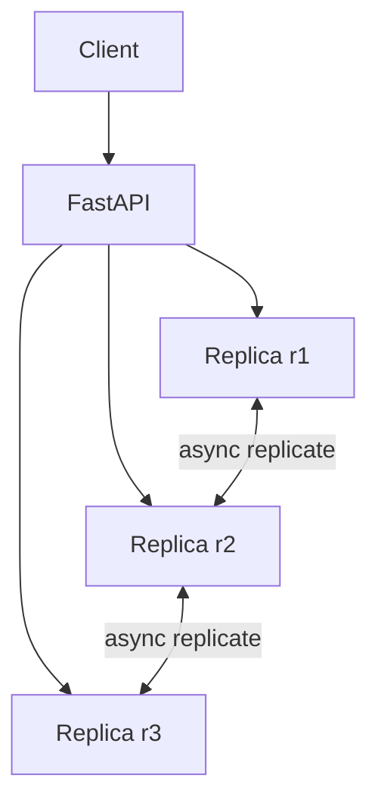

# Lab 005: Eventual Consistency Simulation

Build a **multi-replica key-value simulator** demonstrating async replication, version vectors, session guarantees, and read repair.

Related chapter: [Eventual Consistency](/docs/consistency/eventual-consistency).

## Architecture



1. **Writes** apply locally and enqueue replication events
2. **Replication** delivers events with optional partition isolation
3. **Read repair** pushes latest version to lagging replicas

## Quick start

```bash
cd labs/lab-005-eventual-consistency
python3 -m venv .venv && source .venv/bin/activate
pip install -r requirements.txt
pytest tests/ -v
python -m src.main --demo
python -m src.main --serve    # http://localhost:8099
```

**Docker:**

```bash
docker compose -p lab005 -f docker/docker-compose.yml up --build -d
curl http://localhost:8099/health
chmod +x scripts/demo_consistency.sh && ./scripts/demo_consistency.sh
```

## Demo flow

| Step | Endpoint | What happens |
|------|----------|--------------|
| 1 | `POST /v1/keys/user:1` | Write on replica r1 |
| 2 | `GET /v1/keys/user:1?replica=r2` | Stale read before replication |
| 3 | `POST /v1/replicate/run` | Deliver pending events |
| 4 | `GET /v1/keys/user:1?replica=r2` | Converged read |
| 5 | `POST /v1/chaos/partition` | Isolate replica during partition |

**Swagger:** http://localhost:8099/docs

## Tests

```bash
pytest tests/ -v
```

## Interview discussion

**Expected signals:**

- Distinguishes eventual consistency from strong consistency with concrete examples
- Explains read repair vs background anti-entropy tradeoffs
- States safety vs liveness during partition

**Red flags:**

- Claims eventual consistency means any read anytime is correct
- Ignores version comparison on reads

## References

- Vogels, Eventually Consistent (2008)
- [Eventual Consistency](/docs/consistency/eventual-consistency)
- DeCandia et al., Dynamo (2007)
