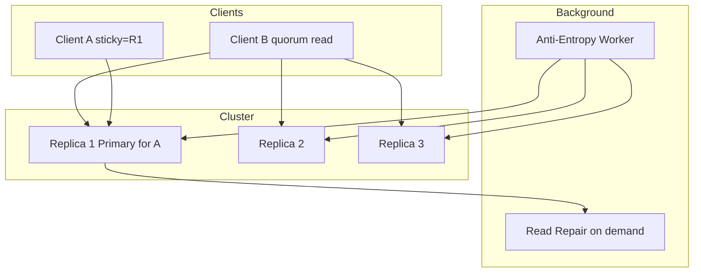
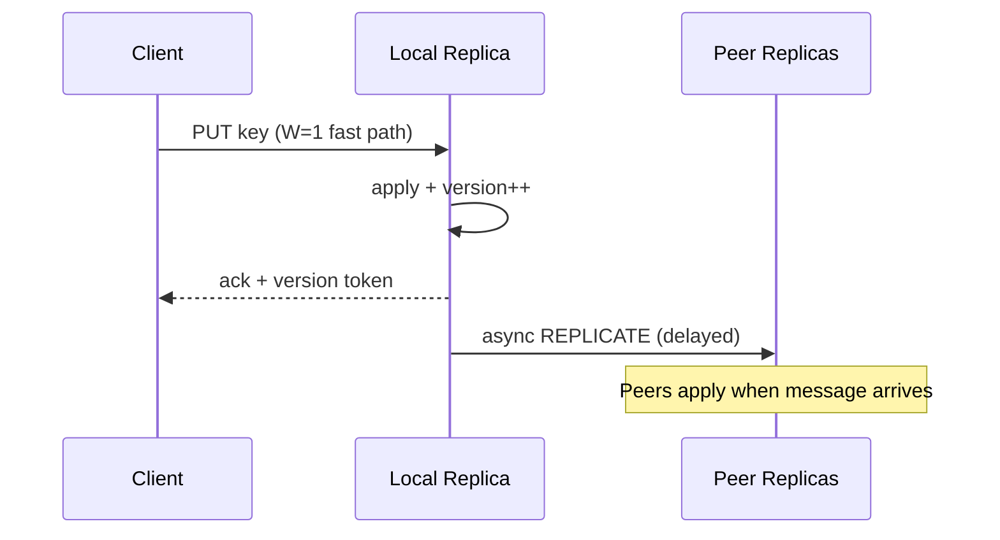
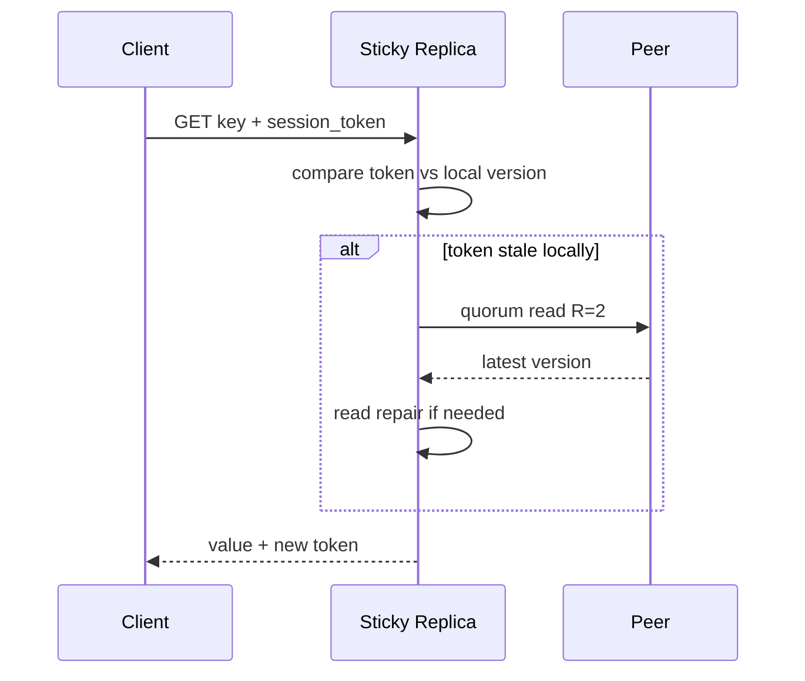

# Lab 005: Architecture

## Overview

Three-tier simulation: **client session layer**, **replica cluster**, and **background convergence** — mirroring Cassandra, DynamoDB (eventual mode), and Riak patterns.



## Write Path



**Safety:** With `W=1`, acknowledged write may be lost if sole replica fails before replication — document this tradeoff.

**Liveness:** Writes succeed during partition if client targets reachable replica (AP behavior).

## Read Path with Session Token



## Consistency Modes

| Mode | Behavior | Use case |
|------|----------|----------|
| Eventual | Any replica may serve stale read | High read availability |
| Read-your-writes | Sticky + token | User sees own updates |
| Monotonic reads | Token prevents time travel | Feed pagination |
| Quorum (R+W>N) | Overlapping read/write sets | Stronger per-key guarantees |

## Component Responsibilities

| Component | Responsibility |
|-----------|----------------|
| `Replica` | Local KV + version vector per key |
| `ReplicationBus` | Delayed, lossy message delivery |
| `SessionRouter` | Sticky replica + token management |
| `ReadRepair` | On-read divergence healing |
| `AntiEntropy` | Background checksum sync |

## Docker Topology

3 containers (`replica-1`, `replica-2`, `replica-3`) each running `src/main.py --replica-id N`. Optional `simulator` container drives chaos.

## Data Model

```
Key: string
Value: bytes
VersionVector: {replica_id: counter}
SessionToken: opaque client-held version summary
Tombstone: deleted keys replicate as tombstones
```

## Related Documentation

- [Eventual Consistency](/docs/consistency/eventual-consistency)
- [Conflict Resolution](/docs/replication/conflict-resolution)
- [Vector Clocks](/docs/time-ordering-and-coordination/vector-clocks)
