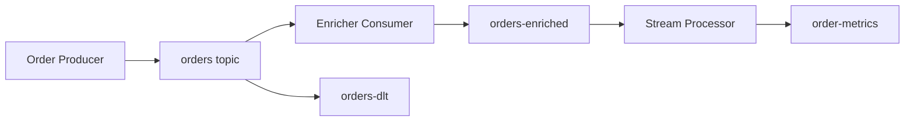

# Lab 006: Kafka Stream Processing

Build an **event-driven order analytics pipeline** that demonstrates production stream-processing concerns: partitioned topics, at-least-once consumers, windowed aggregation, and dead-letter routing.

Related chapter: [Kafka Architecture](/docs/messaging-and-streaming/kafka-architecture).

## The pipeline



1. **Producer** — idempotent writes; partition key = `customer_id`
2. **Enricher** — schema validation, enrichment, idempotent handler
3. **Aggregator** — 1-minute tumbling windows (`count`, `revenue` by `region`)
4. **DLT** — poison messages routed for replay

Uses an **in-memory broker** (Kafka stand-in) — same pattern as Lab 009. Optional real Kafka via Docker `--profile full`.

## Quick start

```bash
cd labs/lab-006-kafka-stream-processing
python3 -m venv .venv && source .venv/bin/activate
pip install -r requirements.txt
pytest tests/ -v
python -m src.main --demo
python -m src.main --serve    # http://localhost:8094
```

**Docker:**

```bash
docker compose -p lab006 -f docker/docker-compose.yml up --build -d
curl http://localhost:8094/health
chmod +x scripts/demo_kafka.sh && ./scripts/demo_kafka.sh
```

Optional real Kafka: `docker compose -p lab006 --profile full -f docker/docker-compose.yml up -d` (broker on `:9094`)

## Demo flow

| Step | Endpoint | What happens |
|------|----------|--------------|
| 1 | `POST /v1/orders` | Produce to `orders` (partition by `customer_id`) |
| 2 | `POST /v1/enricher/run` | Validate + enrich → `orders-enriched` |
| 3 | `POST /v1/aggregator/run` | Tumbling 1-min windows → `order-metrics` |
| 4 | `POST /v1/poison/inject` | Invalid message for DLT demo |
| 5 | `POST /v1/enricher/run` | Poison → `orders-dlt` |
| 6 | `GET /v1/metrics` | Windowed `count` + `revenue` |

**Swagger:** http://localhost:8094/docs

## Tests

```bash
pytest tests/ -v
```

| Test | Validates |
|------|-----------|
| `test_producer_partition_routing` | Same key → same partition |
| `test_consumer_at_least_once` | Idempotent handler dedupes |
| `test_windowed_aggregate` | Correct 1-min metrics |
| `test_dlt_on_poison_message` | Bad record → DLT |
| `test_replay_dlt` | DLT replay re-produces |
| `test_http_pipeline` | Full API flow |

## Interview discussion

**Expected signals:**

- Explains **at-least-once vs exactly-once** with idempotent consumers
- States partition key choice affects ordering scope and hot partitions
- Describes DLT + replay as operational pattern vs infinite retries

**Red flags:**

- Claims exactly-once without discussing external side effects
- Ignores offset commit ordering relative to side effects

## References

- [Kafka Architecture](/docs/messaging-and-streaming/kafka-architecture)
- [Message Delivery Semantics](/docs/messaging-and-streaming/message-delivery-semantics)
- [Lab 009 — Transactional Outbox](../lab-009-outbox-pattern/)
