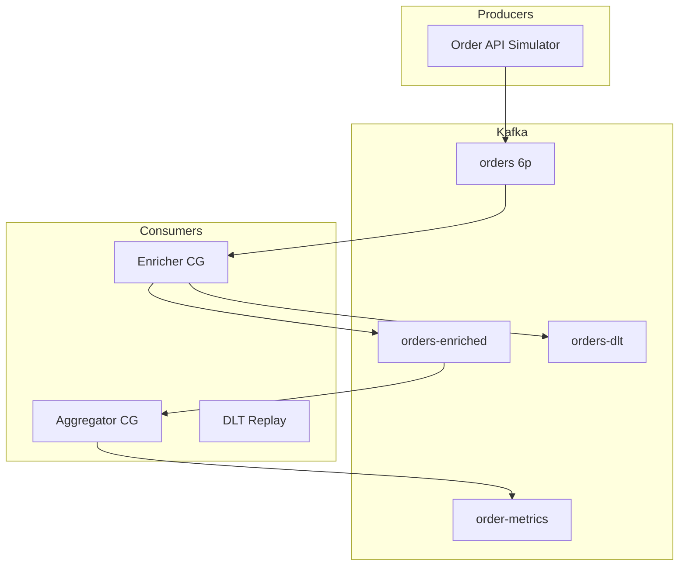
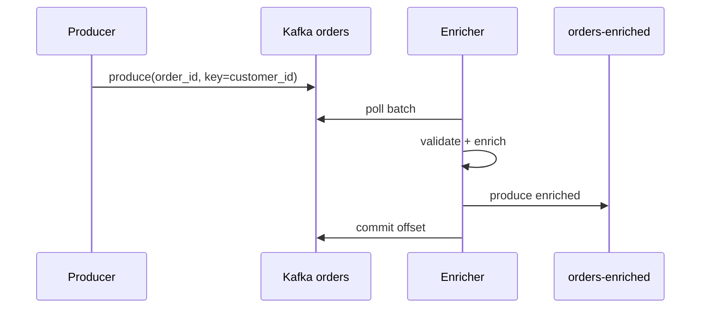

# Lab 006: Architecture

## Overview

Classic **log-oriented pipeline**: raw events → enriched stream → derived metrics — the pattern behind real-time analytics, fraud detection, and inventory updates.



## Message Flow



**Safety:** At-least-once processing requires idempotent writes to output topic and external stores.

**Liveness:** Consumer group continues if one member dies; partitions reassigned.

## Topic Configuration

| Topic | Partitions | Retention | Key |
|-------|------------|-----------|-----|
| orders | 6 | 7d | customer_id |
| orders-enriched | 6 | 7d | customer_id |
| order-metrics | 3 | 30d | window_start |
| orders-dlt | 3 | 90d | original_key |

## Windowing Model

Tumbling 1-minute windows keyed by `region`:

```
window_start = floor(event_time / 60s) * 60s
emit: {window_start, region, count, revenue}
```

Document event-time vs processing-time skew handling (watermark stub).

## Component Responsibilities

| Component | Responsibility |
|-----------|----------------|
| `OrderProducer` | Synthetic load, idempotent config |
| `Enricher` | Schema validation, enrichment |
| `WindowAggregator` | Per-key window state |
| `DLTHandler` | Poison message routing |
| `ReplayTool` | DLT → source topic re-drive |

## Docker Topology

- `kafka` (KRaft single-node for lab)
- Optional `kafka-ui` for topic inspection
- Processor containers run `src/main.py --role enricher|aggregator`

## Related Documentation

- [Apache Kafka](/docs/distributed-databases/apache-kafka)
- [Event-Driven Architecture](/docs/messaging-and-streaming/event-driven-architecture)
