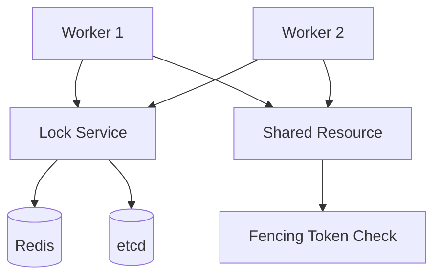

# Lab 007: Distributed Locks and Fencing Tokens

## Objective

Implement **distributed lock primitives** and demonstrate why **fencing tokens** are required for safe shared-resource access:

1. **Redis-based lock** with TTL and renewal (Redlock-style discussion).
2. **etcd lease-based lock** with compare-and-swap semantics.
3. **Fencing token** issuance monotonic per resource.
4. **Stale lock holder** scenario: delayed process writes after lock expired.
5. Shared **resource simulator** (e.g., blob store) that rejects writes without valid fencing token.

See [architecture.md](./architecture.md) and [requirements.md](./requirements.md).

## Prerequisites

- Read [Distributed Leases](/docs/consensus/distributed-leases).
- Read [Fencing Tokens](/docs/consensus/fencing-tokens).
- Read [etcd](/docs/consensus/etcd).
- Go 1.22+, Docker Compose.

## Architecture



*Figure 1: Workers acquire locks; resource validates monotonic fencing tokens.*

Full design: [architecture.md](./architecture.md).

## Setup

```bash
cd labs/lab-007-distributed-locks
go mod tidy
docker compose -f docker/docker-compose.yml up -d
go run ./src/main.go --demo
go test ./tests/... -v
```

## Implementation Steps

### Step 1: Redis lock

`SET key token NX PX ttl_ms`. Unlock with Lua compare-and-del. Document why TTL alone is insufficient.

### Step 2: Lock renewal

Background goroutine extends TTL while work in progress; stop renewal before release.

### Step 3: Fencing token service

Central counter (etcd or in-memory for lab) returns strictly increasing `fence_id` per `resource_id`.

### Step 4: Resource gate

`Write(resource_id, fence_id, data)` rejects if `fence_id <= last_committed_fence`.

### Step 5: Stale holder demo

Simulate GC pause: worker holds lock past TTL, another worker acquires, first worker resumes — fenced write rejected.

### Step 6: etcd lease lock (optional track)

Use etcd session + lease for lock with automatic release on session expiry.

## Tests

```bash
go test ./tests/... -v -race
```

| Test | Validates |
|------|-----------|
| `TestRedisLockAcquireRelease` | Only one holder |
| `TestLockTTLExpiry` | Lock released after TTL |
| `TestFencingRejectsStale` | Lower fence_id rejected |
| `TestMonotonicFencing` | Tokens increase |
| `TestStaleHolderScenario` | Delayed writer fenced |

## Failure Injection

| Scenario | Injection | Expected |
|----------|-----------|----------|
| Redis slow | Inject latency | Lock acquire timeout |
| Process pause | Sleep past TTL | New acquirer succeeds |
| Network partition | Isolate worker | Lock expires; fencing protects resource |
| Clock skew | Document — do not rely on wall clock for correctness |

```bash
go run ./src/main.go --chaos stale-holder --pause-ms 5000
```

## Observability

- `lock_acquire_latency_seconds`
- `lock_renewal_total`
- `fencing_reject_total`
- `lock_holder_id` gauge (per resource)

## Security

- Lock tokens cryptographically random (not predictable).
- etcd/Redis auth in production — stub ACL docs only.
- Rate-limit lock acquire attempts per client.

## Cost Controls

Local Docker: Redis + etcd containers (~256MB each). Production:

- etcd cluster for coordination SLA
- Redis memory for lock key cardinality

## Cleanup

```bash
docker compose -f docker/docker-compose.yml down -v
```

## Interview Discussion

**Expected signals:**

- Explains **fencing vs lock** — lock protects coordinator; fence protects resource.
- Critiques **Redlock** with Martin Kleppmann arguments (optional deep dive).
- States **safety**: no concurrent writers to resource; **liveness**: lock eventually available.
- Distinguishes lease expiry from explicit unlock.

**Follow-ups:**

- How does DynamoDB conditional writes act as fencing?
- ZooKeeper vs etcd lock recipes?
- Design lock-free alternative for your use case.

**Red flags:**

- Claims distributed lock is sufficient without fencing for external stores.
- Uses wall-clock TTL as sole correctness mechanism.

## Extension Exercises

1. Implement **Chubby-style** advisory locks with client callbacks.
2. Add **watchdog** metrics for renewal failures.
3. Benchmark lock contention at 100 workers.
4. Compare **PostgreSQL advisory locks** for same pattern.

## References

- Kleppmann, How to do distributed locking
- [Fencing Tokens](/docs/consensus/fencing-tokens)
- [Distributed Leases](/docs/consensus/distributed-leases)
