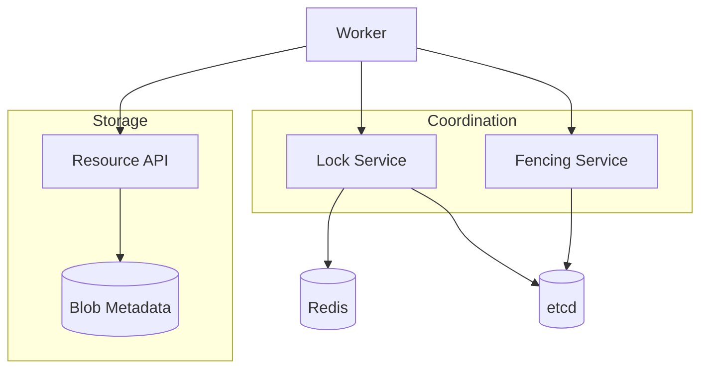
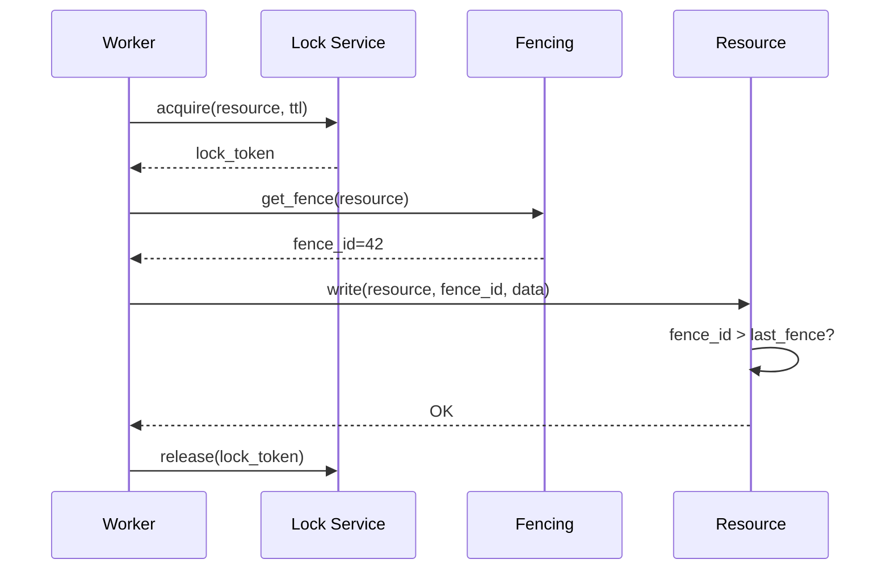
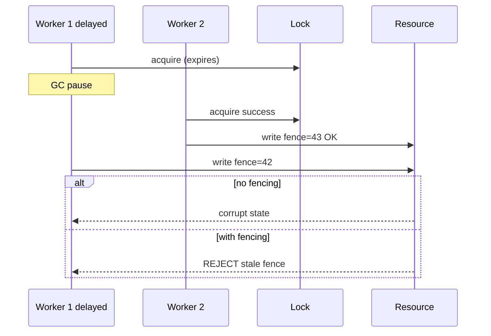

# Lab 007: Architecture

## Overview

Separates **coordination plane** (lock/lease) from **data plane** (resource with fencing) — the pattern required for leader election, shard migration, and shared storage writers.

## Lock Acquire Sequence

## Stale Holder (Safety Violation Without Fencing)

## Safety and Liveness

| Property | Mechanism |
|----------|-----------|
| Safety (mutual exclusion) | Single lock holder per resource (best-effort with Redis) |
| Safety (resource integrity) | Monotonic fencing at resource |
| Liveness | TTL expiry frees lock; retry with backoff |

## Component Responsibilities

| Component | Responsibility |
|-----------|----------------|
| `RedisLock` | NX+PX acquire, Lua release |
| `LockRenewer` | Periodic TTL extension |
| `FencingService` | Monotonic counter per resource |
| `GatedResource` | Reject stale fence writes |
| `StaleHolderSim` | Chaos: pause + delayed write |

## Docker Topology

- `redis:7` on 6379
- `quay.io/coreos/etcd:v3.5` on 2379

## Related Documentation

- [Fencing Tokens](/docs/consensus/fencing-tokens)
- [etcd](/docs/consensus/etcd)
