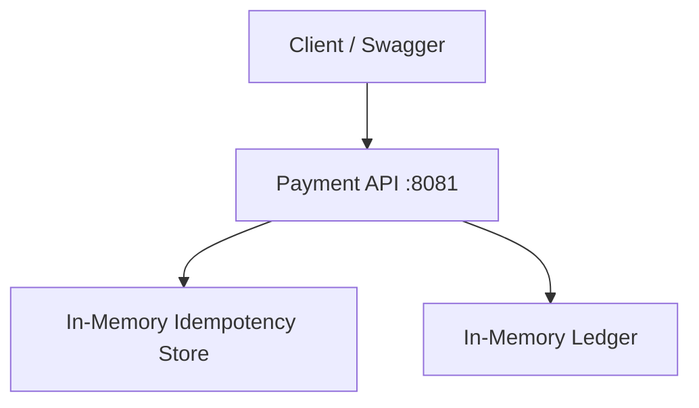

# Lab 008: Idempotent API Design

**Intro hands-on lab** — learn idempotency mechanics in ~30 minutes before [Lab 017: Stripe Payment Idempotency](../lab-017-stripe-payment-idempotency/) (full PostgreSQL + Stripe mock stack).

## Objective

Build and operate a **payment-style HTTP API** with server-side idempotency:

1. **`Idempotency-Key`** header on `POST /v1/payments`
2. **In-memory idempotency store** with TTL and response replay
3. **Concurrent duplicate** handling — one ledger entry per key
4. **Webhook `event_id` deduplication**
5. **Swagger UI** at `/docs` for interactive testing

## Architecture



Full design: [architecture.md](./architecture.md).

## Quick start

```bash
cd labs/lab-008-idempotent-api
python3 -m venv .venv && source .venv/bin/activate
pip install -r requirements.txt
pytest tests/ -v
python -m src.main --demo          # CLI idempotency demo
python -m src.main --serve         # API on http://localhost:8081
```

In another terminal:

```bash
chmod +x scripts/demo_retry.sh
./scripts/demo_retry.sh
```

**Docker (optional):**

```bash
docker compose -f docker/docker-compose.yml up --build -d
curl http://localhost:8091/health
./scripts/demo_retry.sh
```

**Note:** Docker maps host port **8091** → container `8081` (avoids conflict with other local services on 8081).

## Engineer guide

### API contract — `POST /v1/payments`

| Header | Required | Purpose |
|--------|----------|---------|
| `Idempotency-Key` | Yes | One key per logical payment; reuse on retry |
| `X-Tenant-Id` | No (default `demo`) | Scopes keys per tenant |

**Body:**

```json
{"amount": 10.0, "currency": "USD"}
```

**Success — `201 Created`:**

```json
{
  "payment_id": "pay-000001",
  "status": "completed",
  "amount": 10.0,
  "currency": "USD"
}
```

### Handler flow (`src/service.py`)

1. Validate `Idempotency-Key` and body → `400` if missing.
2. Lookup `(tenant_id, key)` — if `completed`, return cached JSON (**no new ledger row**).
3. If same key + different body → `409 Conflict`.
4. If `in_flight` → `409` (concurrent duplicate).
5. Claim key as `in_flight`, append one ledger entry, mark `completed`, cache response.

### New payment vs idempotent replay

| Signal | New payment | Replay |
|--------|-------------|--------|
| `payment_id` | New value | Same as first call |
| `GET /health` → `ledger_entries` | +1 | Unchanged |
| Same `Idempotency-Key` | First use | Reused |

**Swagger:** http://localhost:8081/docs — use body `{"amount": 10.0, "currency": "USD"}`, not the generic placeholder.

### Error codes

| HTTP | Cause |
|------|-------|
| `201` | New payment or idempotent replay |
| `400` | Missing key or invalid amount/currency |
| `409` | Same key, different body, or in-flight |
| `422` | Pydantic validation (bad Swagger body) |

### Code map

| File | Role |
|------|------|
| `src/service.py` | Idempotency store + payment ledger |
| `src/api.py` | FastAPI routes, HTML landing page |
| `src/schemas.py` | `PaymentRequest` OpenAPI schema |
| `src/main.py` | CLI `--serve`, `--demo` |

## Tests

```bash
pytest tests/ -v   # 12 tests
```

## Progression to Lab 017

| Lab 008 (this lab) | Lab 017 (Stripe scenario) |
|--------------------|---------------------------|
| In-memory store | PostgreSQL / SQLite |
| `POST /v1/payments` | `POST /v1/charges` |
| No Stripe | Stripe mock + webhooks + sweeper |
| Port `8081` | Port `8080` |

Portal: [Stripe Payment Idempotency](/docs/real-world-scenarios/stripe-payment-idempotency#hands-on-lab-local).

## Interview discussion

> "Retries are safe when the server stores idempotency keys before side effects and replays cached responses. Lab 008 proves the pattern in memory; Lab 017 adds durability, async webhooks, and reconciliation."

## References

- [Idempotency](/docs/distributed-systems-foundations/idempotency)
- [Stripe scenario](/docs/real-world-scenarios/stripe-payment-idempotency)
- [Lab 017](../lab-017-stripe-payment-idempotency/)
