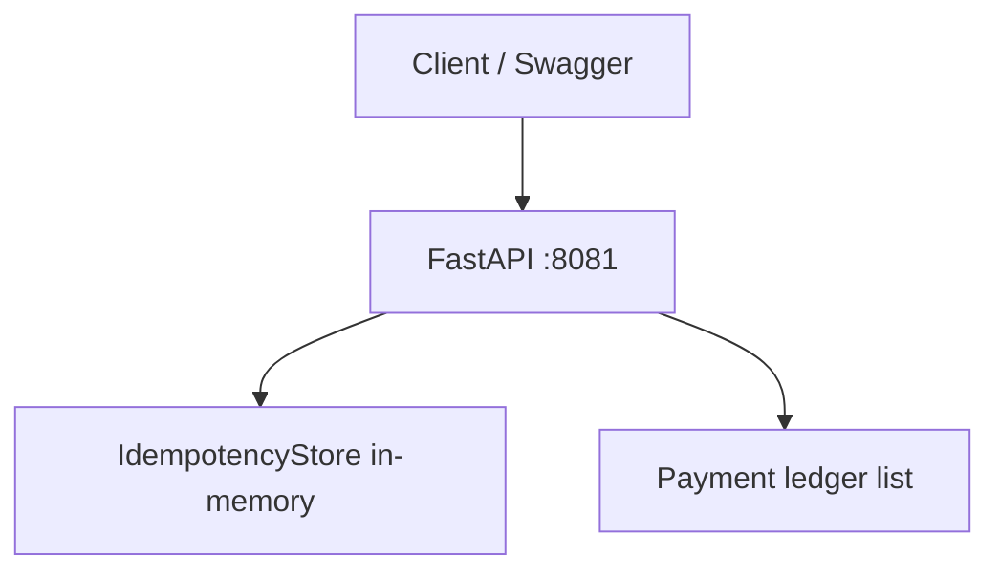
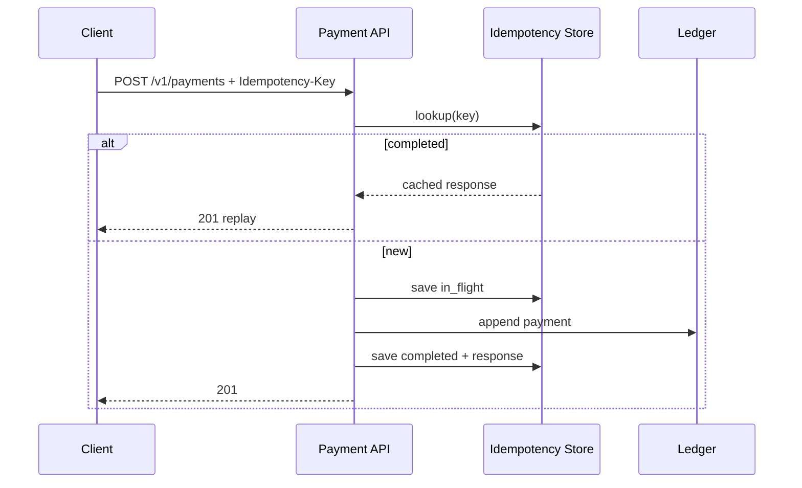

# Lab 008: Architecture

## Overview

**Middleware-first idempotency** — validate key, claim in-flight, execute once, cache response for replay. Same pattern as Stripe, PayPal, and internal payment gateways; implemented here as a single `PaymentService` class for clarity.



## Request lifecycle



## Idempotency record

```
tenant_id + idempotency_key (unique per store)
status: in_flight | completed | failed
request_hash: SHA256(canonical JSON body)
response_status: int
response_body: bytes
created_at, expires_at (24h TTL)
```

## Storage model

This intro lab uses **in-memory** structures only — no Redis or SQLite. Data is lost on process restart. For durable storage, see [Lab 017](../lab-017-stripe-payment-idempotency/).

## HTTP surface

| Method | Path | Purpose |
|--------|------|---------|
| `GET` | `/` | HTML landing page |
| `GET` | `/health` | Status + `ledger_entries` count |
| `POST` | `/v1/payments` | Idempotent payment create |
| `POST` | `/v1/webhooks` | Webhook dedup by `event_id` |
| `GET` | `/docs` | Swagger UI |

## Verifying correctness

| Check | New payment | Replay |
|-------|-------------|--------|
| `payment_id` in response | New | Same |
| `/health` `ledger_entries` | Increments | Unchanged |

## Related documentation

- [Idempotency](/docs/distributed-systems-foundations/idempotency)
- [Stripe Payment Idempotency](/docs/real-world-scenarios/stripe-payment-idempotency)
