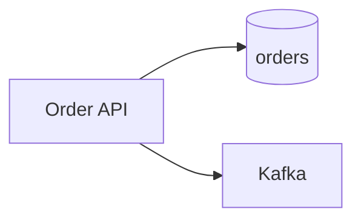
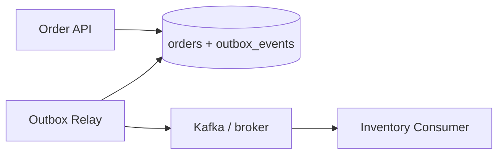

# Lab 009: Transactional Outbox Pattern

Reliable event publishing **without the dual-write problem**: business row and outbox row commit in **one transaction**; a relay publishes asynchronously; consumers dedupe by `event_id`.

Related scenario: [Shopify Transactional Outbox](/docs/real-world-scenarios/shopify-transactional-outbox).

## The problem (dual-write)



If you write to DB **and** publish to Kafka separately, one can succeed and the other fail → **inconsistent state** (order exists, no event; or event fired, no order).

## The solution (outbox)



1. **Same transaction:** `INSERT order` + `INSERT outbox_event`
2. **Relay:** poll `published_at IS NULL` → publish → mark published
3. **Consumer:** idempotent by `event_id` (at-least-once safe)

## Quick start

```bash
cd labs/lab-009-outbox-pattern
python3 -m venv .venv && source .venv/bin/activate
pip install -r requirements.txt
pytest tests/ -v
python -m src.main --demo
python -m src.main --serve    # http://localhost:8092
```

**Docker:**

```bash
docker compose -p lab009 -f docker/docker-compose.yml up --build -d
curl http://localhost:8092/health
chmod +x scripts/demo_outbox.sh && ./scripts/demo_outbox.sh
```

Optional full stack (Postgres + Kafka profiles): `docker compose -p lab009 --profile full -f docker/docker-compose.yml up -d`

## Demo flow (Swagger or script)

| Step | Endpoint | What happens |
|------|----------|--------------|
| 1 | `POST /v1/orders` | Order + `OrderCreated` outbox row — **atomic** |
| 2 | `GET /v1/outbox?pending=true` | See unpublished events |
| 3 | `POST /v1/relay/run` | Relay publishes to in-memory broker |
| 4 | `POST /v1/consumer/run` | Inventory updated (idempotent) |
| 5 | `POST /v1/consumer/run` again | `duplicates` > 0 — dedup works |

**Swagger:** http://localhost:8092/docs

## Engineer guide

### Schema (production)

```sql
CREATE TABLE orders (...);
CREATE TABLE outbox_events (
    id TEXT PRIMARY KEY,
    aggregate_id TEXT NOT NULL,
    event_type TEXT NOT NULL,
    payload JSONB NOT NULL,
    created_at TIMESTAMPTZ NOT NULL DEFAULT NOW(),
    published_at TIMESTAMPTZ
);
```

### Relay algorithm

```
SELECT * FROM outbox_events WHERE published_at IS NULL
  ORDER BY created_at FOR UPDATE SKIP LOCKED LIMIT 100;
-- publish each to Kafka
UPDATE outbox_events SET published_at = NOW() WHERE id = ?;
```

### Failure modes

| Failure | Safe? | Why |
|---------|-------|-----|
| Crash after DB commit, before relay | Yes | Relay retries unpublished rows |
| Crash after publish, before mark | Duplicate publish | Consumer dedupes `event_id` |
| Consumer crash mid-batch | Yes | Reprocess with idempotency |

### Local ↔ production mapping

| Lab 009 | Production |
|---------|------------|
| In-memory `outbox` dict | PostgreSQL `outbox_events` |
| `broker` list | Kafka topic |
| `POST /v1/relay/run` | Outbox relay worker / Debezium CDC |
| `InventoryConsumer` | Downstream microservice |
| Port `8092` | ECS/Lambda + MSK |

## Tests

```bash
pytest tests/ -v   # 9 tests
```

## Progression

| Prior | This lab | Next |
|-------|----------|------|
| [Lab 008](../lab-008-idempotent-api/) — idempotency keys | Outbox + relay + consumer | [Lab 010](../lab-010-saga-orchestration/) — sagas |

## References

- [Transactional Outbox](/docs/transactions/transactional-outbox)
- [Shopify scenario](/docs/real-world-scenarios/shopify-transactional-outbox)
