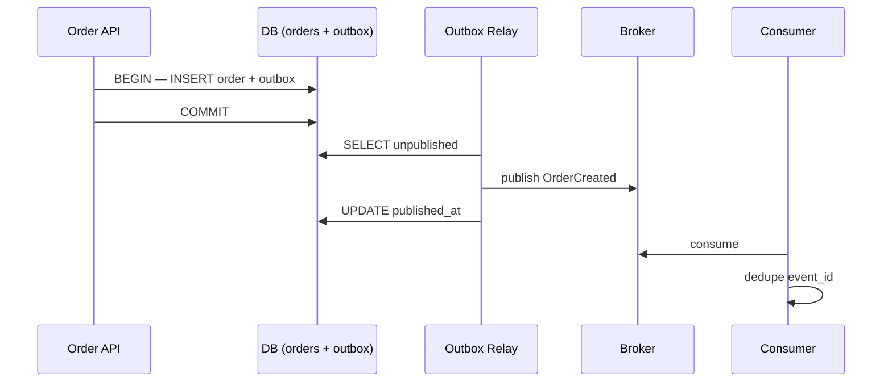

# Lab 009: Architecture

## Components

| Component | File | Role |
|-----------|------|------|
| Order API | `src/api.py` | `POST /v1/orders` — atomic write |
| Transaction store | `src/store.py` | Simulates DB transaction |
| Outbox relay | `src/service.py` `OutboxRelay` | Poll + publish + mark |
| Broker | in-memory list | Kafka stand-in |
| Consumer | `InventoryConsumer` | Idempotent `event_id` dedup |

## Sequence

## HTTP surface

| Method | Path | Purpose |
|--------|------|---------|
| `GET` | `/` | Landing page |
| `GET` | `/health` | Stats |
| `POST` | `/v1/orders` | Create order + outbox atomically |
| `GET` | `/v1/outbox` | List outbox events |
| `POST` | `/v1/relay/run` | Run relay once |
| `GET` | `/v1/broker` | Published messages |
| `POST` | `/v1/consumer/run` | Process broker (idempotent) |

## Verifying the demo

After `./scripts/demo_outbox.sh`:

- `outbox_pending` = 0
- `broker_messages` ≥ 1
- Second consumer run: `duplicates` ≥ 1, `processed` = 0
