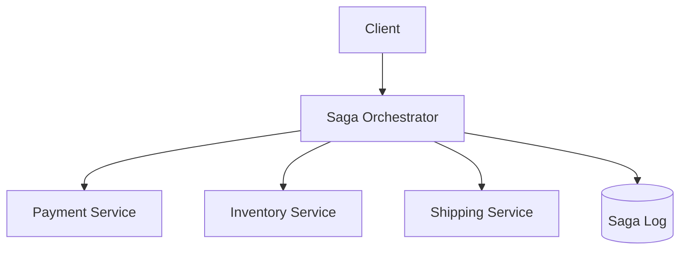
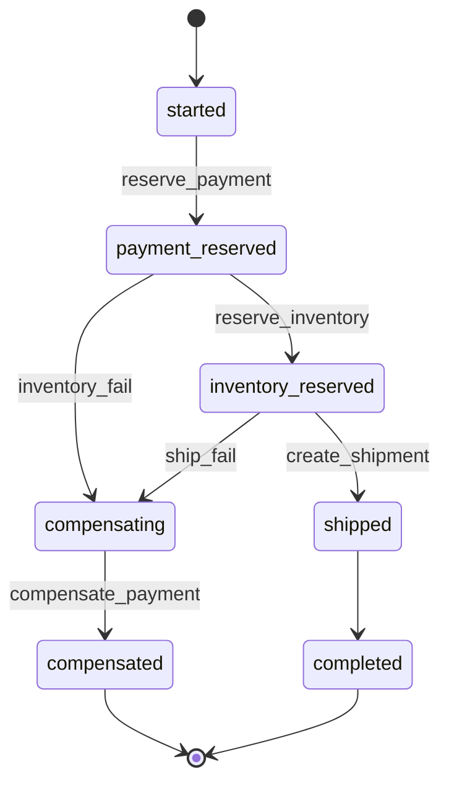

# Lab 010: Saga Orchestration

Build an **orchestration-based saga** for a distributed order workflow: payment → inventory → shipping, with **compensating transactions** when a step fails.

Related chapter: [Sagas](/docs/transactions/sagas).

## The problem

A checkout spans three services, each with its own database. You cannot wrap them in one ACID transaction. If inventory fails after payment is reserved, you must **compensate** (release the payment hold) — not roll back a global transaction.

## The solution (orchestrator)



1. **Orchestrator** drives a state machine and appends each transition to a saga log.
2. **Participants** expose idempotent forward + compensate APIs (in-process stubs here).
3. **On failure** after payment: run `compensate_payment`, mark saga `compensated`.
4. **Crash recovery**: reload saga from log and resume from last committed step.

## Quick start

```bash
cd labs/lab-010-saga-orchestration
go test ./... -v
go run ./src/main.go --demo
go run ./src/main.go --serve    # http://localhost:8093
```

**Docker:**

```bash
docker compose -p lab010 -f docker/docker-compose.yml up --build -d
curl http://localhost:8093/health
chmod +x scripts/demo_saga.sh && ./scripts/demo_saga.sh
```

## Demo flow

| Step | Endpoint | What happens |
|------|----------|--------------|
| 1 | `POST /v1/sagas` | Happy path: payment → inventory → ship → `completed` |
| 2 | `POST /v1/chaos/inventory-fail` | Enable failure injection |
| 3 | `POST /v1/sagas` | Inventory fails → compensate payment → `compensated` |
| 4 | `POST /v1/chaos/reset` | Disable chaos |
| 5 | `POST /v1/sagas/{id}/crash` | Simulate orchestrator crash mid-saga |
| 6 | `POST /v1/sagas/{id}/recover` | Resume from last committed step |

**Swagger UI:** http://localhost:8093/docs

**Landing page:** http://localhost:8093/

## State machine



Full design: [architecture.md](./architecture.md).

## Tests

```bash
go test ./... -v
```

| Test | Validates |
|------|-----------|
| `TestHappyPath` | All steps complete |
| `TestInventoryFailureCompensates` | Payment released |
| `TestOrchestratorCrashRecovery` | Resume mid-saga |
| `TestIdempotentParticipant` | Duplicate step no double reserve |
| `TestTimeoutRetry` | Transient failure then success |
| `TestHTTPSagaHappyPath` | HTTP API happy path |
| `TestHTTPInventoryChaosCompensates` | Chaos + compensation via API |

## Failure injection

```bash
go run ./src/main.go --chaos fail-inventory
# or via HTTP:
curl -X POST http://localhost:8093/v1/chaos/inventory-fail
```

## Observability

`GET /health` returns saga and participant counters:

- `sagas_completed`, `sagas_compensated`, `sagas_failed`
- `payment_calls`, `inventory_calls`, `shipping_calls`, `compensate_calls`

## Interview discussion

**Expected signals:**

- Contrasts **orchestration vs choreography** with tradeoffs.
- Explains compensations are **semantic undo**, not ACID rollback.
- States saga safety: no orphaned reservations without compensation path.
- Identifies **dual-write** risks and outbox integration (Lab 009).

**Follow-ups:**

- When is 2PC preferable (rare cases)?
- How does Temporal/Cadence improve this design?
- Saga vs event sourcing for workflow state?

## Extension exercises

1. Choreography variant with Kafka events only.
2. Add **human approval** step with timeout.
3. Integrate Lab 009 outbox for step events.
4. Split participants into separate HTTP microservices.

## References

- [Sagas](/docs/transactions/sagas)
- [Lab 009 — Transactional Outbox](../lab-009-outbox-pattern/)
- Garcia-Molina & Salem, Sagas (1987)
