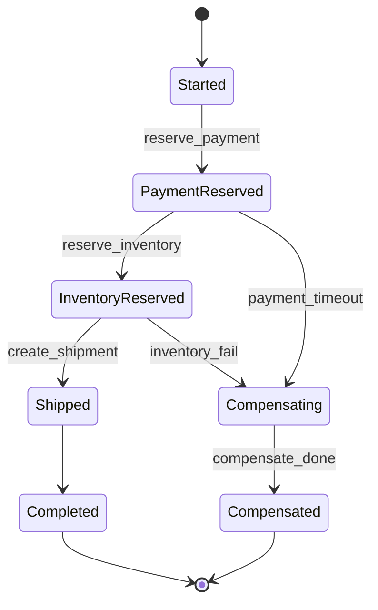
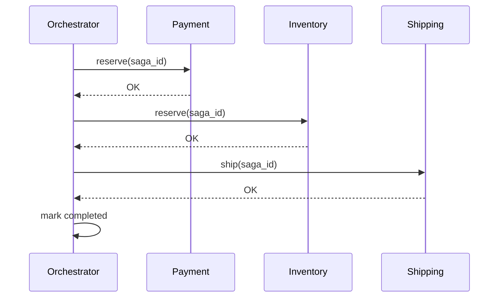
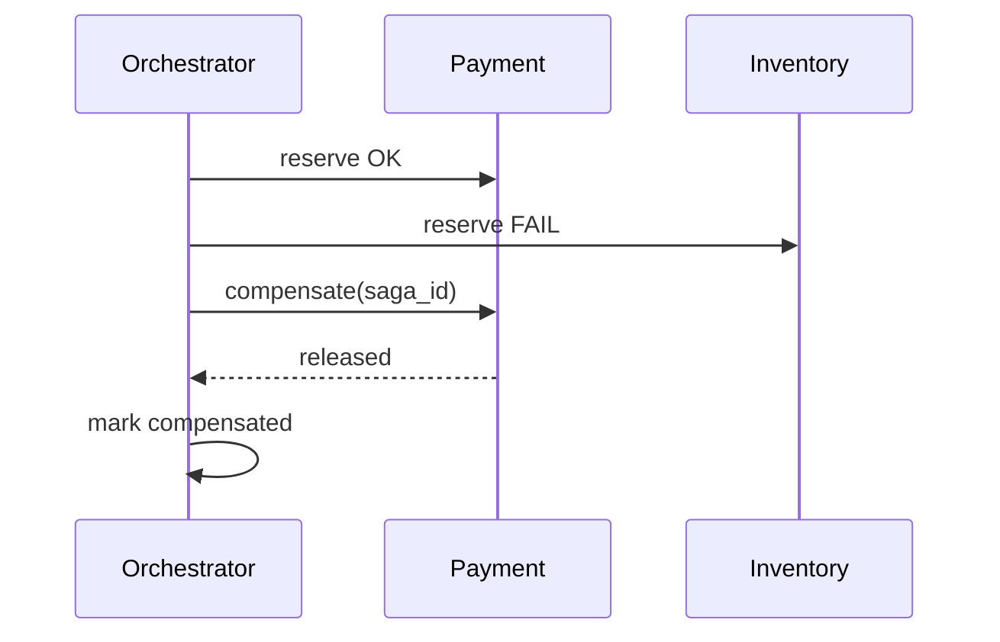

# Lab 010: Architecture

## Overview

**Orchestration-based saga** with explicit state machine and compensations — common in enterprise order, booking, and provisioning flows.

## Happy Path Sequence

## Compensation Sequence

## Safety and Liveness

| Property | Mechanism |
|----------|-----------|
| Safety | Compensations restore business invariants (no ghost holds) |
| Liveness | Retries + timeouts; orchestrator recovery from log |
| Idempotency | saga_id + step_id on all participant calls |

## Component Responsibilities

| Component | Responsibility |
|-----------|----------------|
| `Orchestrator` | State machine driver |
| `SagaLog` | Append-only transition log |
| `PaymentSvc` | Reserve / compensate payment |
| `InventorySvc` | Reserve / release stock |
| `ShippingSvc` | Create / cancel shipment |

## Docker Topology

Services: `orchestrator`, `payment`, `inventory`, `shipping`, `postgres`.

## Related Documentation

- [Sagas](/docs/transactions/sagas)
- [Payment Platform](/docs/system-design/payment-platform)
