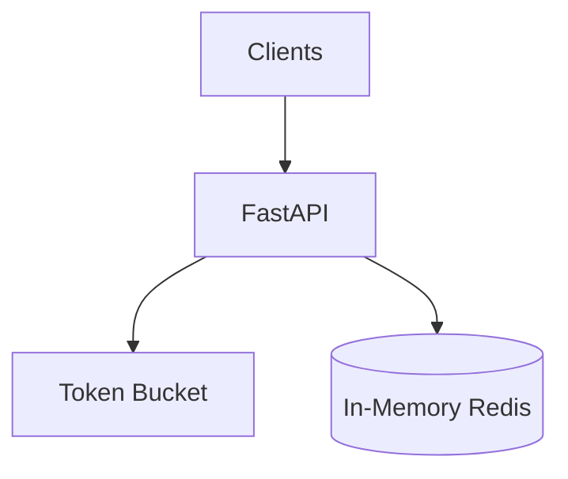

# Lab 011: Distributed Rate Limiter

Implement a **two-tier rate limiter**: local token bucket (burst absorption) + Redis sliding window log (global quota).

Related chapter: [Distributed Rate Limiter](/docs/system-design/distributed-rate-limiter).

## Architecture



1. **Local tier** — cheap burst pre-check via token bucket
2. **Global tier** — sliding window log enforces per-tenant per-route limits
3. **Chaos** — simulate Redis outage (fail-open vs fail-closed)

## Quick start

```bash
cd labs/lab-011-rate-limiter
python3 -m venv .venv && source .venv/bin/activate
pip install -r requirements.txt
pytest tests/ -v
python -m src.main --demo
python -m src.main --serve    # http://localhost:8101
```

**Docker:**

```bash
docker compose -p lab011 -f docker/docker-compose.yml up --build -d
curl http://localhost:8101/health
chmod +x scripts/demo_rate_limit.sh && ./scripts/demo_rate_limit.sh
```

## Demo flow

| Step | Endpoint | What happens |
|------|----------|--------------|
| 1 | `POST /v1/check` | Tenant + route quota check |
| 2 | `GET /health` | Allowed/denied stats |
| 3 | `POST /v1/chaos/redis-down` | Fail-open vs fail-closed simulation |

**Swagger:** http://localhost:8101/docs

## Tests

```bash
pytest tests/ -v
```

## Interview discussion

**Expected signals:**

- Compares token bucket vs sliding window
- Explains fail-open vs fail-closed during Redis outage
- States per-tenant isolation requirements

**Red flags:**

- Single global counter without tenant isolation
- Ignores clock dependency in distributed windows

## References

- [Distributed Rate Limiter](/docs/system-design/distributed-rate-limiter)
- AWS API Gateway throttling documentation
