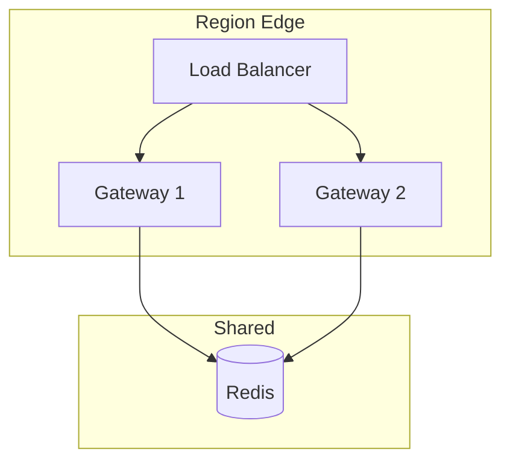
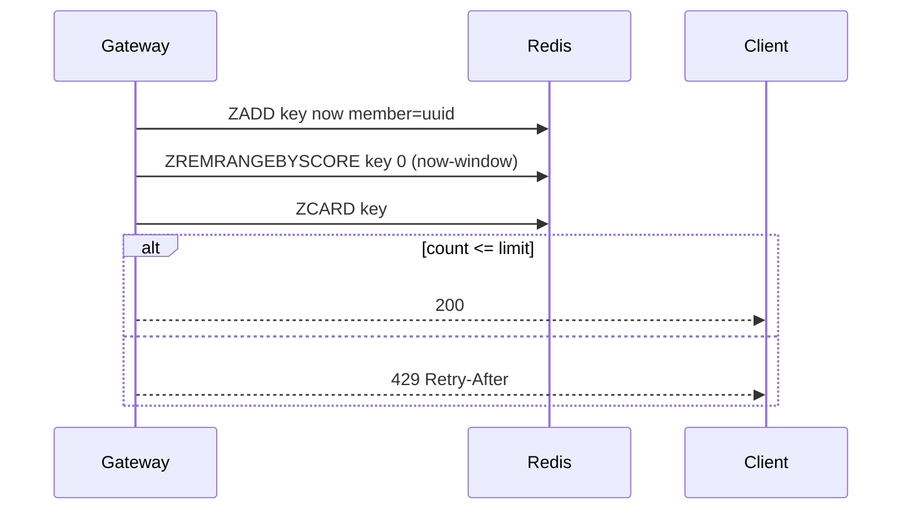

# Lab 011: Architecture

## Overview

**Two-tier rate limiting** at the edge and in shared store — pattern for API platforms, LLM gateways, and multi-tenant SaaS.



## Token Bucket (Local)

```
tokens += (now - last) * rate
if tokens >= 1: tokens -= 1; allow
else: deny
burst capped at bucket size
```

## Sliding Window Log (Redis)



## Algorithm Comparison

| Algorithm | Burst | Memory | Distributed |
|-----------|-------|--------|-------------|
| Token bucket | Smooth burst | O(1) | Needs sync |
| Fixed window | Window edge spike | O(1) | Easy |
| Sliding log | Accurate | O(window requests) | Redis ZSET |
| Sliding counter | Approximate | O(1) | Redis |

## Component Responsibilities

| Component | Responsibility |
|-----------|----------------|
| `TokenBucket` | Local burst control |
| `SlidingWindowLog` | Accurate global limit |
| `RateLimitMiddleware` | HTTP enforcement + headers |
| `RedisBackend` | Atomic Lua scripts |

## Docker Topology

Single `redis:7` container; API server `src/main.py --serve`.

## Related Documentation

- [Distributed Rate Limiter](/docs/system-design/distributed-rate-limiter)
- [LLM Gateway](/docs/system-design/llm-gateway)
