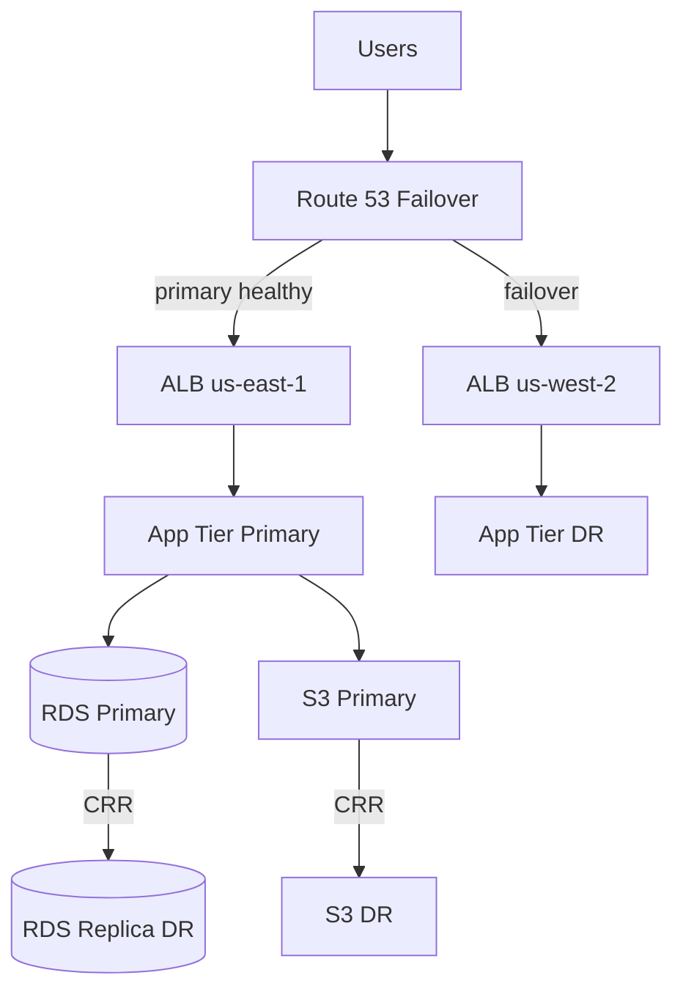

# Lab 012: Multi-Region AWS Architecture

## Objective

Design and **partially deploy** a multi-region active-passive reference architecture on AWS:

1. **Route 53** health checks and failover routing.
2. **Primary region** VPC with ALB, ECS/EKS stub, RDS Multi-AZ.
3. **DR region** warm standby with replicated data (RDS cross-region read replica or S3 replication).
4. **S3 cross-region replication** for static assets and backups.
5. **Runbook** for regional failover and failback with RTO/RPO targets.
6. **Terraform stubs** with explicit cost tags and destroy workflow.

> **⚠️ COST WARNING — READ BEFORE PROCEEDING**
>
> This lab can incur **significant AWS charges** if you deploy full infrastructure in two regions:
>
> - **RDS Multi-AZ + cross-region replica**: ~$50–300+/month depending on instance class (verify current pricing).
> - **NAT Gateway** (per region): ~$32+/month each + data processing charges.
> - **ALB**: ~$16+/month each + LCU charges.
> - **Route 53** health checks: ~$0.50/health check/month.
> - **Data transfer** cross-region: $0.02/GB+ (verify [AWS pricing](https://aws.amazon.com/pricing/)).
>
> **Recommended approach:**
> 1. Complete architecture docs and Terraform **plan-only** (`terraform plan`) without apply.
> 2. Use **minimal instance sizes** (`db.t4g.micro`, single NAT) if you must apply.
> 3. Set `auto_destroy_hours` tag and run cleanup immediately after validation.
> 4. Use **LocalStack** for partial local simulation (limited multi-region fidelity).
> 5. **Never** leave resources running overnight without cost alarms.

See [architecture.md](./architecture.md) and [requirements.md](./requirements.md).

## Prerequisites

- Read [AWS Fundamentals](/docs/cloud-architecture/aws-fundamentals).
- Read [Multi-Region Architecture](/docs/cloud-architecture/multi-region-architecture).
- Read [Disaster Recovery and Multi-Region](/docs/reliability-and-resilience/disaster-recovery-and-multi-region).
- Read [Cloud Cost Optimization](/docs/cost-and-finops/cloud-cost-optimization).
- AWS CLI configured, Terraform 1.5+ (optional apply).

## Architecture



*Figure 1: Active-passive with DNS failover and replicated data plane.*

Full design: [architecture.md](./architecture.md).

## Setup

```bash
cd labs/lab-012-multi-region-aws
python -m venv .venv
source .venv/bin/activate
pip install -r requirements.txt

# Start API (port 8102)
python -m src.main --serve
# Or: docker compose -f docker/docker-compose.yml up -d api
# Demo: ./scripts/demo_multiregion.sh

# Safe: plan only
cd terraform && terraform init && terraform plan -var-file=../config/lab.tfvars.example

# Optional full stack (LocalStack)
docker compose -f docker/docker-compose.yml --profile full up -d

python src/main.py --validate-config
pytest tests/ -v
```

**API endpoints:** `GET /health`, `GET /docs`, `POST /v1/config/validate`, `POST /v1/failover/simulate`

## Implementation Steps

### Step 1: Network foundation

Per region: VPC, 2 AZs, public/private subnets, NAT (document cost).

### Step 2: Data layer

RDS PostgreSQL Multi-AZ in primary; cross-region read replica in DR (or snapshot copy for cheaper lab).

### Step 3: Application tier

Containerized hello-service behind ALB; health check `/health`.

### Step 4: DNS failover

Route 53 primary/secondary records with health check on primary ALB.

### Step 5: Failover runbook

Document promote replica, update DNS TTL, validate RPO from replication lag.

### Step 6: Cost controls

AWS Budgets alarm, resource tags `lab=lab-012`, `auto_destroy=true`.

## Tests

```bash
pytest tests/ -v
```

| Test | Validates |
|------|-----------|
| `test_terraform_valid` | Terraform fmt/validate passes |
| `test_config_rto_rpo` | RTO/RPO documented |
| `test_health_check_spec` | ALB health path defined |
| `test_cost_tags` | All resources tagged |
| `test_failover_runbook` | Runbook sections present |

## Failure Injection

| Scenario | Injection | Expected |
|----------|-----------|----------|
| Primary region down | Stop primary ALB target | DNS fails over to DR |
| DB primary failure | RDS failover Multi-AZ | App recovers in primary region |
| Replication lag | Pause replica | Document RPO breach |

```bash
python src/main.py --simulate-failover --dry-run
```

## Observability

- CloudWatch alarms: ALB 5xx, RDS replication lag, Route 53 health.
- Dashboard: primary vs DR health, lag seconds.
- SNS topic for failover events.

## Security

- Private subnets for app and DB; no public RDS.
- IAM least privilege for Terraform role.
- KMS encryption for RDS and S3; cross-region key policy documented.
- Security groups: ALB → app only, app → DB only.

## Cost Controls

**Mandatory lab practices:**

| Control | Action |
|---------|--------|
| Budget alarm | $25 threshold email alert |
| Instance sizing | `t4g.micro` / `db.t4g.micro` only |
| NAT minimization | Single NAT per region or NAT instance for lab |
| Time box | Destroy within 4 hours of apply |
| Plan-first | Default workflow is `terraform plan` only |

Estimated minimal apply cost: **$5–15/day** if using micro instances and destroying promptly (verify with AWS Pricing Calculator).

## Cleanup

**Critical — run even if lab incomplete:**

```bash
cd terraform && terraform destroy -var-file=../config/lab.tfvars.example
aws s3 rb s3://lab-012-* --force  # if buckets created
docker compose -f docker/docker-compose.yml down -v
```

Verify zero running EC2/RDS in both regions in AWS Console.

## Interview Discussion

**Expected signals:**

- Defines **RTO/RPO** with measurable failover steps.
- Contrasts active-active vs active-passive vs pilot light.
- Explains DNS failover TTL impact on client cutover.
- Discusses **split brain** prevention during partial failures.
- Proactive **cost** discussion for multi-region designs.

**Follow-ups:**

- Global Accelerator vs Route 53 failover?
- DynamoDB Global Tables vs RDS CRR?
- How does Stripe/AWS design multi-region payments?

**Red flags:**

- Multi-region without data replication strategy.
- No failover tested — "DR is documented only."
- Ignores cross-region data transfer cost.

## Extension Exercises

1. Active-active with DynamoDB Global Tables (higher cost — budget first).
2. AWS Fault Injection Simulator experiment.
3. Chaos: terminate primary region ASG.
4. FinOps report from Cost Explorer tagged resources.

## References

- [Multi-Region Architecture](/docs/cloud-architecture/multi-region-architecture)
- [Disaster Recovery and Multi-Region](/docs/reliability-and-resilience/disaster-recovery-and-multi-region)
- AWS Well-Architected Reliability Pillar
