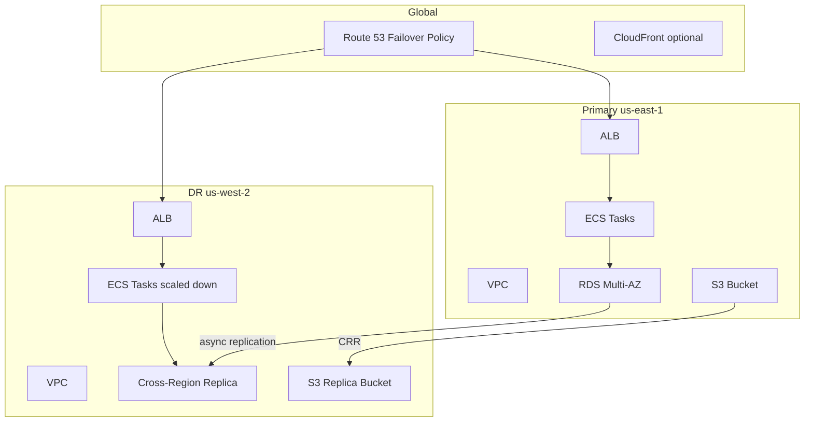
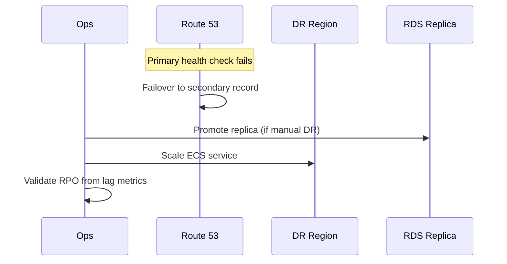

# Lab 012: Architecture

## Overview

**Active-passive multi-region** reference — primary `us-east-1`, DR `us-west-2` — suitable for interview deep-dives and controlled AWS hands-on.

## Failover Sequence

## RTO / RPO Targets (Lab)

| Metric | Target | Mechanism |
|--------|--------|-----------|
| RPO | 5 min | RDS async CRR lag (typical lab) |
| RTO | 15 min | DNS TTL + ECS scale + promote |

Document that production targets require testing and may differ.

## Cost Hotspots

| Resource | Cost driver | Lab mitigation |
|----------|-------------|----------------|
| NAT Gateway | Hourly + GB | Single NAT; destroy promptly |
| RDS | Instance + storage | `db.t4g.micro`, skip Multi-AZ if plan-only |
| Cross-region transfer | Replication | Minimal test data |
| ALB | Hourly + LCU | One ALB per region only |

## Component Responsibilities

| Component | Responsibility |
|-----------|----------------|
| `terraform/` | VPC, ALB, RDS, Route53 stubs |
| `src/main.py` | Config validation, dry-run failover |
| `runbooks/failover.md` | Operational steps (create in implementation) |
| `config/lab.tfvars.example` | Sized-down variables |

## Docker Topology (Local)

`localstack` partial AWS API simulation — **not** full multi-region fidelity.

## Related Documentation

- [AWS Fundamentals](/docs/cloud-architecture/aws-fundamentals)
- [Cloud Cost Optimization](/docs/cost-and-finops/cloud-cost-optimization)
