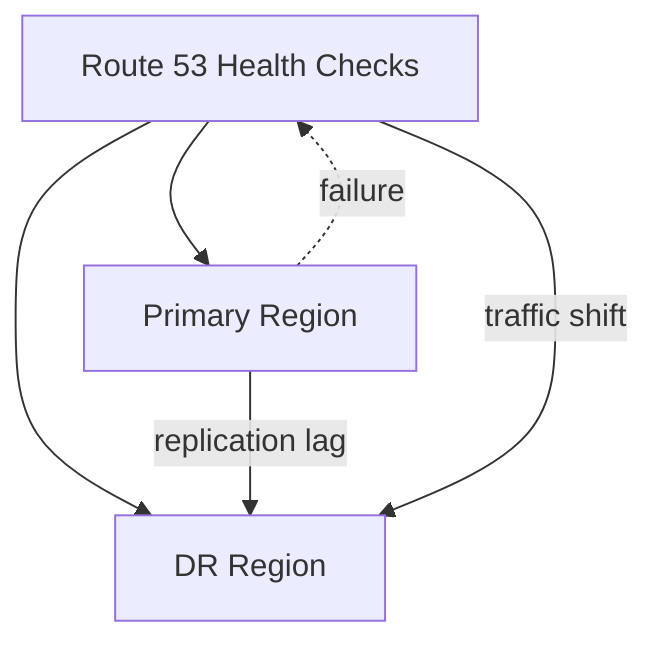

# Failover Runbook — Lab 012

## Failover Topology



*Figure: Multi-region failover — health checks trigger DNS traffic shift to DR.*

## RTO / RPO

| Metric | Target | Verification |
|--------|--------|--------------|
| RPO | 5 minutes | RDS `ReplicaLag` CloudWatch metric |
| RTO | 15 minutes | Time from primary failure to DR health OK |

## Prerequisites

- AWS CLI credentials with appropriate region access
- Terraform state accessible
- On-call notification channel configured

## Failover Steps (Primary Region Unavailable)

1. Confirm primary region outage (not transient blip): ALB health checks, Route 53 status.
2. Record current RDS replication lag from CloudWatch. If lag > RPO target, document data loss window.
3. Route 53: verify failover to secondary record (or trigger manual policy update).
4. If using manual DR database promotion:
   ```bash
   # Template — replace identifiers; verify AWS docs for current promote API
   aws rds promote-read-replica --db-instance-identifier lab-012-dr-replica --region us-west-2
   ```
5. Scale DR application tier (ECS desired count / ASG).
6. Run smoke tests against DR ALB endpoint.
7. Update status page and incident channel.

## Failback Steps

1. Restore primary region infrastructure if destroyed.
2. Establish replication from new primary (DR) back to restored region OR restore from snapshot.
3. Verify data sync and replication lag near zero.
4. Switch Route 53 primary record back during maintenance window.
5. Scale primary application tier; reduce DR to warm standby.

## Cost Reminder

Destroy lab resources after exercise:

```bash
cd terraform && terraform destroy -var-file=../config/lab.tfvars.example
```
