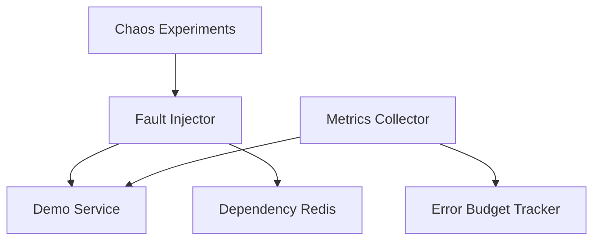

# Lab 013: Chaos Engineering and Fault Injection

## Objective

Apply **chaos engineering** discipline to a sample microservice stack:

1. Define **steady-state hypotheses** and SLIs before injecting faults.
2. **Fault injector** for latency, error rate, CPU, and dependency failure.
3. **Game day** script: run experiments with blast radius controls.
4. Measure **error budget** consumption during experiments.
5. Document **abort conditions** and automated rollback.

Target: Lab 004 KV cluster or bundled `demo-service` in Docker.

See [architecture.md](./architecture.md) and [requirements.md](./requirements.md).

## Prerequisites

- Read [Chaos Engineering](/docs/reliability-and-resilience/chaos-engineering).
- Read [SLO, SLI, and Error Budgets](/docs/reliability-and-resilience/slo-sli-error-budgets).
- Go 1.22+, Docker Compose.

## Architecture



*Figure 1: Controlled faults with observability and abort gates.*

Full design: [architecture.md](./architecture.md).

## Setup

```bash
cd labs/lab-013-chaos-testing
go mod tidy
docker compose -f docker/docker-compose.yml up -d
go run ./src/main.go --demo
go test ./tests/... -v
```

## Implementation Steps

### Step 1: Steady state

Define SLI: success rate ≥ 99.9%, p99 latency < 200ms on `/api/work`.

### Step 2: Fault injector middleware

Togglable: `latency_ms`, `error_rate`, `dependency_timeout`.

### Step 3: Experiment manifest

YAML: `name`, `hypothesis`, `fault`, `duration`, `blast_radius`, `abort_on`.

### Step 4: Runner

Execute experiment, poll metrics, abort if SLO breach exceeds threshold.

### Step 5: Game day report

Auto-generate markdown: hypothesis, result, budget consumed, findings.

### Step 6: Integration with KV lab

Optional: chaos flags compatible with Lab 004 `--chaos` patterns.

## Tests

```bash
go test ./tests/... -v
```

| Test | Validates |
|------|-----------|
| `TestLatencyInjection` | p99 increases under fault |
| `TestErrorInjection` | Error rate matches config |
| `TestAbortOnSLO` | Experiment stops on breach |
| `TestBlastRadius` | Only targeted instances faulted |
| `TestReportGeneration` | Report contains hypothesis |

## Failure Injection

| Experiment | Fault | Hypothesis |
|------------|-------|------------|
| dep-slow | Redis +500ms | Latency rises but success stable |
| dep-down | Redis unavailable | Circuit breaker degrades gracefully |
| cpu-stress | CPU burn | Autoscale or queue backlog |

```bash
go run ./src/main.go --experiment experiments/dep-slow.yaml
```

## Observability

- Pre/post experiment metric snapshots
- `error_budget_remaining_ratio`
- Experiment audit log with operator identity

## Security

- Chaos tooling restricted to non-production namespaces.
- RBAC: only platform team runs cluster-level chaos.
- No chaos in shared prod accounts without change control.

## Cost Controls

Local Docker only. Production chaos (AWS FIS, Gremlin):

- FIS experiment charges minimal but target resource costs continue
- Run during business hours with approval

## Cleanup

```bash
docker compose -f docker/docker-compose.yml down -v
rm -rf reports/
```

## Interview Discussion

**Expected signals:**

- Defines **steady state** before breaking things.
- Blast radius, rollback, and abort criteria.
- Error budget as guardrail for experiment frequency.
- Contrasts chaos vs unplanned outage learning.

**Follow-ups:**

- How did Netflix Chaos Monkey evolve?
- Chaos in Kubernetes (Litmus vs Chaos Mesh)?
- When is chaos irresponsible?

**Red flags:**

- Random production faults without hypothesis.
- No abort mechanism.

## Extension Exercises

1. Kubernetes Chaos Mesh experiment.
2. Network partition with `tc` or toxiproxy.
3. Combine with Lab 014 dashboards.
4. Post-experiment automated Jira ticket stub.

## References

- [Chaos Engineering](/docs/reliability-and-resilience/chaos-engineering)
- Basiri et al., Chaos Engineering (IEEE)
