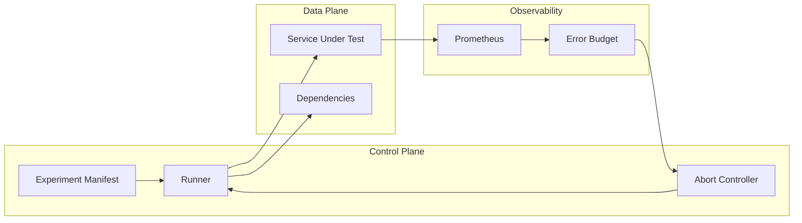
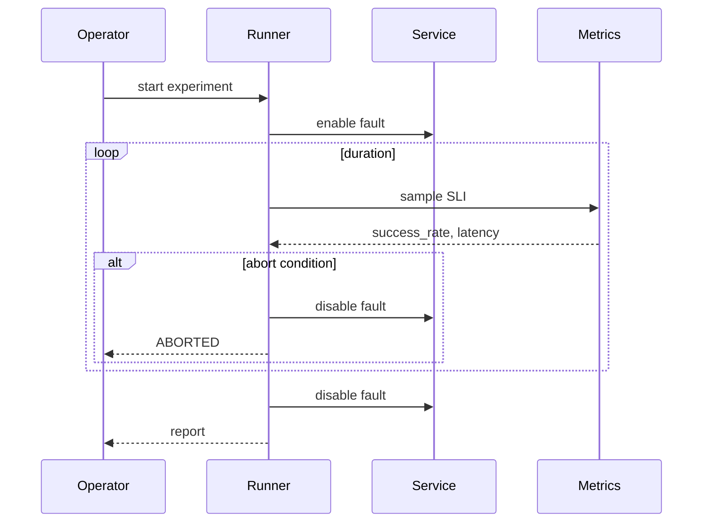

# Lab 013: Architecture

## Overview

**Closed-loop chaos** — hypothesize, inject, measure, learn — aligned with principled chaos engineering practice.



## Experiment Lifecycle



## Experiment Manifest (YAML)

```yaml
name: dep-slow
hypothesis: "Degraded dependency increases latency but error rate stays < 1%"
fault:
  type: dependency_latency
  target: redis
  latency_ms: 500
duration_seconds: 120
blast_radius:
  instances: ["demo-1"]
abort_on:
  error_rate_gt: 0.05
  success_rate_lt: 0.99
```

## Safety Properties

| Property | Mechanism |
|----------|-----------|
| Blast radius | Target tags / single instance |
| Abort | Automated SLO breach detection |
| Audit | Experiment log with timestamps |

## Component Responsibilities

| Component | Responsibility |
|-----------|----------------|
| `FaultInjector` | Apply/remove faults |
| `ExperimentRunner` | Orchestrate lifecycle |
| `SLICollector` | Pull metrics |
| `ErrorBudget` | Track burn during experiment |
| `ReportGenerator` | Game day summary |

## Docker Topology

`demo-service`, `redis`, `prometheus` (optional), `chaos-runner`.

## Related Documentation

- [Chaos Engineering](/docs/reliability-and-resilience/chaos-engineering)
- [SLO, SLI, and Error Budgets](/docs/reliability-and-resilience/slo-sli-error-budgets)
