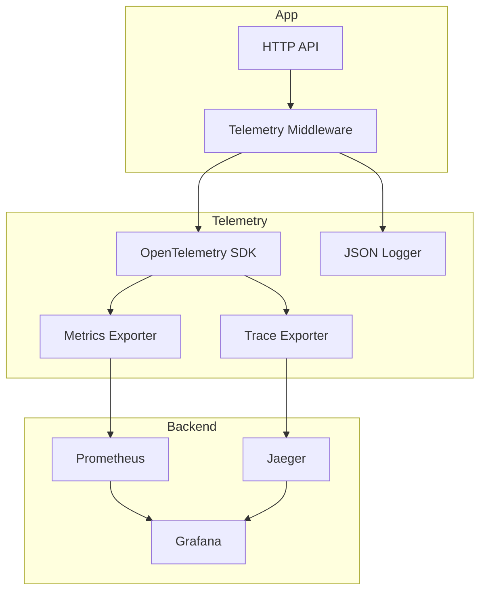
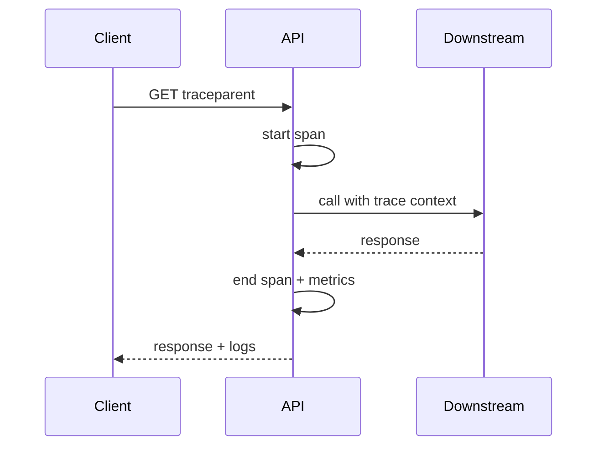

# Lab 014: Architecture

## Overview

**Three pillars, one correlation ID** — production observability baseline for microservices and platform teams.



## Request Path Instrumentation



## RED Metrics

| Metric | Type | Labels |
|--------|------|--------|
| `http_requests_total` | Counter | route, status |
| `http_request_duration_seconds` | Histogram | route |
| `http_requests_in_flight` | Gauge | route |

## SLO Example

```
SLI: success rate = 1 - (5xx / total)
SLO: 99.9% over 30 days
Burn alert: 14.4x burn over 1h window
```

## Component Responsibilities

| Component | Responsibility |
|-----------|----------------|
| `TelemetryMiddleware` | Metrics + trace + log context |
| `MetricsRegistry` | Prometheus counters/histograms |
| `TraceProvider` | OTel tracer setup |
| `dashboards/` | Grafana JSON |
| `prometheus.yml` | Scrape config |

## Docker Topology

`app`, `prometheus`, `jaeger`, `grafana`, optional `otel-collector`.

## Related Documentation

- [Metrics Platform](/docs/system-design/metrics-platform)
- [Logging Platform](/docs/system-design/logging-platform)
