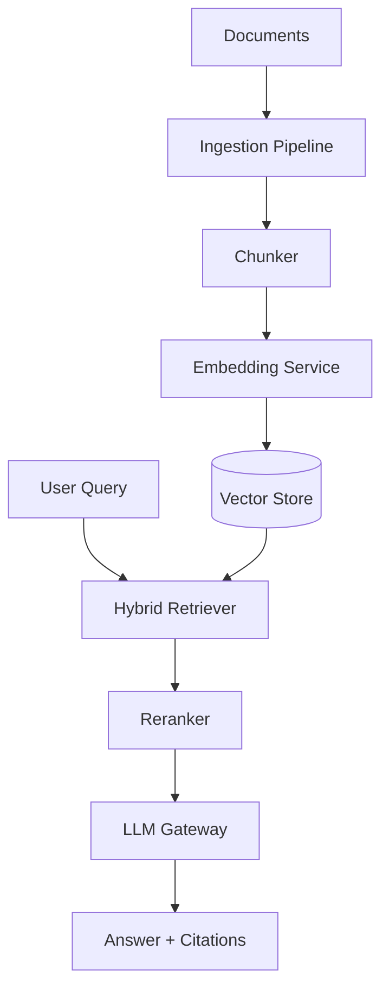

# Lab 015: RAG Platform Architecture

## Objective

Build a **retrieval-augmented generation (RAG) platform** skeleton covering production concerns beyond naive vector search:

1. **Document ingestion pipeline**: chunk, embed, index with metadata.
2. **Hybrid retrieval**: vector similarity + keyword (BM25) fusion.
3. **Reranking** stage (stub cross-encoder) before LLM context assembly.
4. **LLM gateway** with timeout, retry, and token budget limits.
5. **Evaluation harness**: recall@k and answer faithfulness checks (stub).

Local stack: embedding API stub, vector store (in-memory or pgvector), optional Redis cache.

See [architecture.md](./architecture.md) and [requirements.md](./requirements.md).

## Prerequisites

- Read [RAG Architecture](/docs/ai-distributed-systems/rag-architecture).
- Read [LLM Serving and Model Gateways](/docs/ai-distributed-systems/llm-serving-and-model-gateways).
- Python 3.11+, Docker Compose (PostgreSQL + pgvector optional).

## Architecture



*Figure 1: Ingestion and query paths with retrieval stack.*

Full design: [architecture.md](./architecture.md).

## Setup

```bash
cd labs/lab-015-rag-platform
python -m venv .venv
source .venv/bin/activate
pip install -r requirements.txt

# Start API (port 8105)
python -m src.main --serve
# Or: docker compose -f docker/docker-compose.yml up -d api
# Demo: ./scripts/demo_rag.sh

# Optional full stack (pgvector + Redis)
docker compose -f docker/docker-compose.yml --profile full up -d

python src/main.py --ingest sample_docs/quorum.txt
python src/main.py --query "What is quorum replication?"
pytest tests/ -v
```

**API endpoints:** `GET /health`, `GET /docs`, `POST /v1/documents`, `GET /v1/documents`, `POST /v1/query`

## Implementation Steps

### Step 1: Chunking strategy

Fixed-size with overlap + metadata (`doc_id`, `section`, `acl_tenant`).

### Step 2: Embedding service

Stub deterministic embeddings for tests; interface for OpenAI-compatible API.

### Step 3: Vector store

`upsert` and `search` with metadata filters (tenant isolation).

### Step 4: Hybrid retrieval

Combine vector scores + BM25 with weighted fusion (e.g., 0.7/0.3).

### Step 5: Context assembly

Token budget trim; cite `chunk_id` sources in response.

### Step 6: LLM gateway

Rate limit, circuit breaker, fallback model, log prompt hash not raw PII.

## Tests

```bash
pytest tests/ -v
```

| Test | Validates |
|------|-----------|
| `test_chunking_overlap` | Chunks cover document with overlap |
| `test_vector_search` | Top-k returns relevant chunk |
| `test_hybrid_fusion` | Keyword-only doc retrievable |
| `test_tenant_filter` | Cross-tenant chunks excluded |
| `test_citation_in_response` | Answer includes source ids |

## Failure Injection

| Scenario | Injection | Expected |
|----------|-----------|----------|
| Embedding timeout | Slow embedder | Degraded keyword-only retrieval |
| LLM timeout | Gateway timeout | Partial answer + error code |
| Stale index | Skip re-ingest | Document changes not reflected |

```bash
python src/main.py --inject embedding-timeout
```

## Observability

- `rag_retrieval_latency_seconds`
- `rag_chunks_retrieved`, `rag_llm_tokens_total`
- Trace: query → retrieve → rerank → generate spans

## Security

- **Tenant ACL** on metadata filter — mandatory.
- Prompt injection defenses: sanitize retrieved text boundaries.
- Do not log full prompts with secrets; hash document ids.
- API keys via environment variables only.

## Cost Controls

Local stubs: **$0**. Production cost drivers:

- Embedding API $/1M tokens
- Vector DB storage and query units
- LLM generation tokens (dominant)
- Re-embedding on every doc change

Lab uses deterministic embeddings unless `OPENAI_API_KEY` explicitly set.

## Cleanup

```bash
docker compose -f docker/docker-compose.yml down -v
deactivate
rm -rf data/index/
```

## Interview Discussion

**Expected signals:**

- RAG vs fine-tuning tradeoffs.
- Chunking impact on recall; hybrid retrieval rationale.
- Freshness: incremental index updates vs batch.
- Evaluation: offline recall + online user feedback.
- Gateway patterns: rate limits, caching, model routing.

**Follow-ups:**

- When RAG fails — graph RAG, tool use?
- Multi-modal RAG pipeline?
- Cost optimize: cache embeddings, smaller reranker?

**Red flags:**

- Vector search only, no ACL.
- No evaluation or freshness strategy.

## Extension Exercises

1. Add **pgvector** persistent index.
2. Implement **query rewriting** step.
3. **Semantic cache** for repeated queries.
4. Integrate Lab 014 tracing.

## References

- [RAG Architecture](/docs/ai-distributed-systems/rag-architecture)
- [LLM Gateway](/docs/system-design/llm-gateway)
