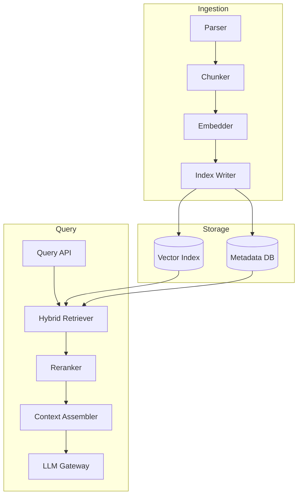
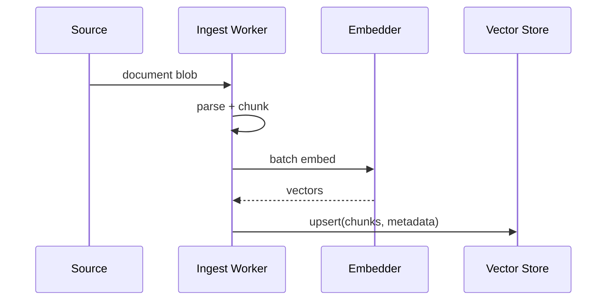

# Lab 015: Architecture

## Overview

**Platform-style RAG** — ingestion, indexing, retrieval, generation as separate scalable services — not a monolithic script.



## Ingestion Flow



## Retrieval Fusion

```
score = α * cosine_sim + (1-α) * bm25_norm
top_k → reranker → top_n for context
```

Document α tuning and per-collection overrides.

## Safety and Quality

| Concern | Mitigation |
|---------|------------|
| Tenant isolation | Metadata filter on every query |
| Hallucination | Citations required; faithfulness eval |
| Prompt injection | Delimiter wrapping retrieved chunks |
| Cost runaway | Token budget + gateway limits |

## Component Responsibilities

| Component | Responsibility |
|-----------|----------------|
| `Chunker` | Split docs with overlap |
| `EmbeddingClient` | Vectorize text |
| `VectorStore` | Similarity + metadata filter |
| `BM25Index` | Lexical search |
| `LLMGateway` | Model call with resilience |
| `EvalHarness` | recall@k stub |

## Docker Topology

`postgres` with pgvector extension (optional), `redis` for embedding cache.

## Related Documentation

- [RAG Architecture](/docs/ai-distributed-systems/rag-architecture)
- [Distributed Training and Inference](/docs/ai-distributed-systems/distributed-training-and-inference)
