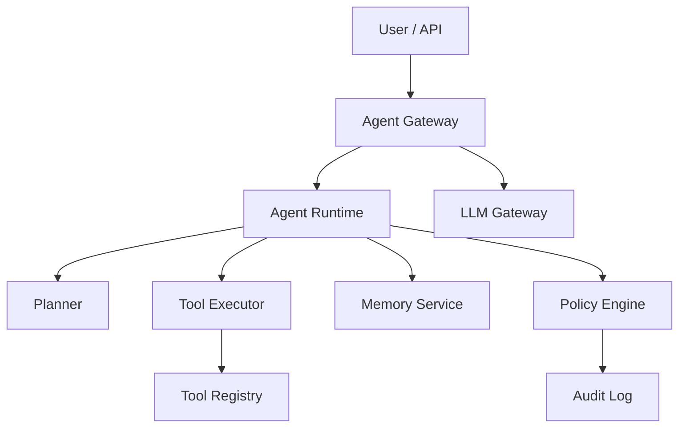

# Lab 016: Agentic AI Platform

## Objective

Design and stub an **agentic AI platform** for orchestrating tools, memory, and human approvals at scale:

1. **Agent runtime** with planner → executor loop (ReAct-style stub).
2. **Tool registry** with schema validation and permission scopes.
3. **Session memory** (short-term) and **knowledge memory** (RAG integration from Lab 015).
4. **Human-in-the-loop** approval gate for high-risk tools.
5. **Governance**: policy engine, audit log, rate limits, cost budgets per tenant.
6. **Observability**: trace each tool call; link to Lab 014 patterns.

See [architecture.md](./architecture.md) and [requirements.md](./requirements.md).

## Prerequisites

- Complete Lab 015 recommended (RAG integration).
- Read [Agent Platform Architecture](/docs/agentic-ai-architecture/agent-platform-architecture).
- Read [Agent Governance and Safety](/docs/agentic-ai-architecture/agent-governance-and-safety).
- Read [Agentic AI Platform Design](/docs/system-design/agentic-ai-platform-design).
- Python 3.11+, Docker Compose.

## Architecture



*Figure 1: Gateway enforces policy; runtime orchestrates plan, tools, and memory.*

Full design: [architecture.md](./architecture.md).

## Setup

```bash
cd labs/lab-016-agentic-ai-platform
python -m venv .venv
source .venv/bin/activate
pip install -r requirements.txt

# Start API (port 8106)
python -m src.main --serve
# Or: docker compose -f docker/docker-compose.yml up -d api
# Demo: ./scripts/demo_agent.sh

# Optional full stack (Redis + Postgres)
docker compose -f docker/docker-compose.yml --profile full up -d

python src/main.py --agent support-agent --task "Summarize ticket 42"
pytest tests/ -v
```

**API endpoints:** `GET /health`, `GET /docs`, `POST /v1/agents/run`, `GET /v1/agents/runs`, `POST /v1/tools/invoke`

## Implementation Steps

### Step 1: Tool registry

Register tools: `search_kb`, `create_ticket`, `send_email` (stub). JSON Schema parameters.

### Step 2: Agent runtime loop

Observe → plan (LLM) → validate tool call → execute → append to trace.

### Step 3: Policy engine

Rules: `send_email` requires approval; `search_kb` allowed always; tenant budget max tokens.

### Step 4: Human approval workflow

Pending approval state; resume with `approval_id`.

### Step 5: Memory layers

Session buffer (last N turns); optional RAG retrieval for `search_kb`.

### Step 6: Audit and observability

Immutable audit: `tenant`, `agent_id`, `tool`, `args_hash`, `result_status`.

## Tests

```bash
pytest tests/ -v
```

| Test | Validates |
|------|-----------|
| `test_tool_schema_validation` | Invalid args rejected |
| `test_policy_blocks_tool` | Denied tool not executed |
| `test_approval_required` | High-risk tool pauses |
| `test_agent_loop_terminates` | Max steps enforced |
| `test_audit_log_complete` | Every tool call logged |

## Failure Injection

| Scenario | Injection | Expected |
|----------|-----------|----------|
| Tool timeout | Slow tool | Retry then fail gracefully |
| LLM hallucinated tool | Invalid tool name | Schema/policy rejection |
| Budget exceeded | Token limit | Agent stops with error |

```bash
python src/main.py --inject budget-exceeded
```

## Observability

- `agent_steps_total`, `agent_tool_latency_seconds`
- `agent_policy_denials_total`
- Distributed trace per agent run (spans: plan, tool, approve)

## Security

- **Tool sandbox**: no arbitrary code execution in default lab.
- Least-privilege scopes per agent profile.
- Human approval for exfiltration-risk tools (email, http_post).
- Prompt injection: treat tool outputs as untrusted data.
- Secrets only via env; never in agent prompts from user docs.

## Cost Controls

Local stubs: **$0**. Production:

- LLM tokens per agent loop (multi-step amplification)
- Tool API costs (search, ticketing)
- Storage for audit logs

Per-tenant **token budget** enforced in gateway (implement in lab).

## Cleanup

```bash
docker compose -f docker/docker-compose.yml down -v
deactivate
rm -rf data/sessions/
```

## Interview Discussion

**Expected signals:**

- Agent loop vs single-shot LLM — when agents help vs hurt.
- Governance: policy, approval, audit — not optional for enterprise.
- Tool reliability and compensating actions.
- Evaluation: task success rate, tool accuracy, safety incidents.
- Cost control: step limits, caching, smaller models for planning.

**Follow-ups:**

- Compare to Temporal for long-running agents?
- Multi-agent coordination patterns?
- How OpenAI/Anthropic tool use maps to this design?

**Red flags:**

- Unlimited agent loops without budgets.
- No approval for destructive tools.
- Tool outputs trusted blindly into next prompt.

## Extension Exercises

1. Integrate Lab 015 RAG as `search_kb` tool.
2. Multi-agent supervisor pattern.
3. OpenTelemetry traces for full run.
4. WASM sandbox for user-defined tools.

## References

- [Agent Platform Architecture](/docs/agentic-ai-architecture/agent-platform-architecture)
- [Agent Governance and Safety](/docs/agentic-ai-architecture/agent-governance-and-safety)
- [Agentic AI Platform Design](/docs/system-design/agentic-ai-platform-design)
