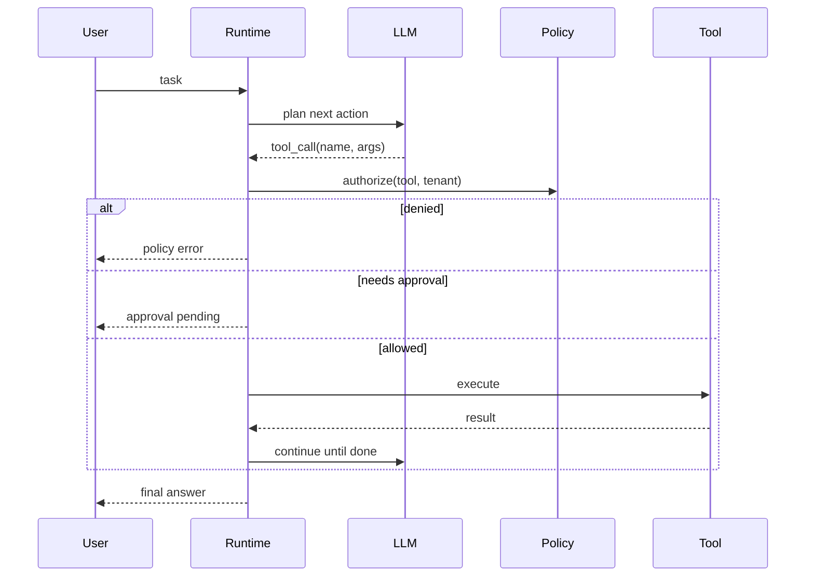

# Lab 016: Architecture

## Overview

**Enterprise agent platform** — gateway, runtime, tools, policy, memory, audit — mirroring internal agent platforms at large SaaS vendors.

```mermaid
flowchart TB
    subgraph Control
        GW[Agent Gateway]
        POL[Policy Engine]
        AUD[Audit Store]
    end
    subgraph Runtime
        AR[Agent Runtime]
        PL[Planner]
        EX[Executor]
        APR[Approval Service]
    end
    subgraph Tools
        REG[Tool Registry]
        T1[search_kb]
        T2[create_ticket]
        T3[send_email]
    end
    subgraph Memory
        SM[Session Memory]
        KM[Knowledge / RAG]
    end
    GW --> POL --> AR
    AR --> PL --> EX
    EX --> REG --> T1 & T2 & T3
    AR --> SM & KM
    EX --> APR
    AR --> AUD
```

## Agent Loop

## Policy Model

| Tool | Risk | Default policy |
|------|------|----------------|
| search_kb | Low | Allow |
| create_ticket | Medium | Allow + audit |
| send_email | High | Require approval |
| http_post | Critical | Deny default |

## Safety Properties

| Property | Mechanism |
|----------|-----------|
| Bounded execution | `max_steps` per run |
| Cost safety | Token budget per tenant |
| Auditability | Immutable tool audit log |
| Human gate | Approval for high-risk tools |

## Component Responsibilities

| Component | Responsibility |
|-----------|----------------|
| `AgentGateway` | AuthN, rate limit, budget |
| `AgentRuntime` | ReAct loop orchestration |
| `ToolRegistry` | Schema + handler registry |
| `PolicyEngine` | Rule evaluation |
| `ApprovalService` | HITL workflow |
| `AuditLogger` | Append-only events |

## Docker Topology

`redis` (session state), `postgres` (audit), optional link to Lab 015 postgres.

## Related Documentation

- [Agent Governance and Safety](/docs/agentic-ai-architecture/agent-governance-and-safety)
- [LLM Gateway](/docs/system-design/llm-gateway)
