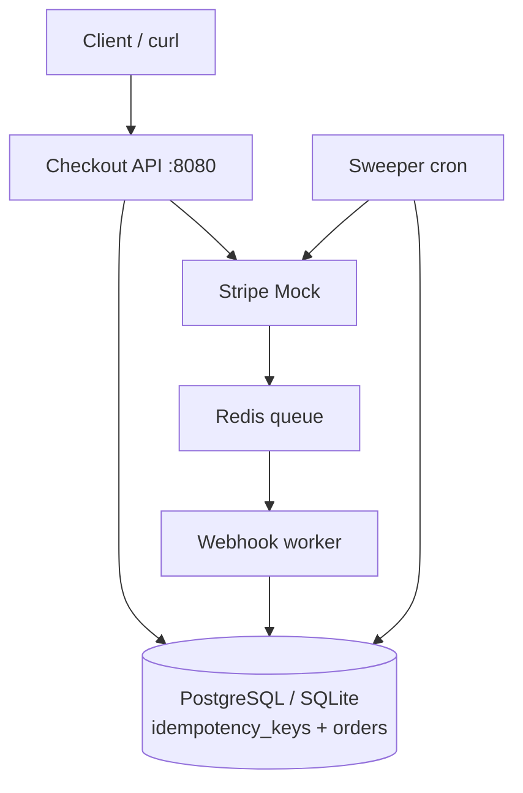

# Lab 017: Stripe Payment Idempotency (Local Hands-On)

Full **local** hands-on lab for the portal scenario [Stripe Payment Idempotency](/docs/real-world-scenarios/stripe-payment-idempotency). **No AWS account required** — runs on your laptop with Python, optional Docker Compose (PostgreSQL + Redis).

## Objective

Build and operate a **Stripe-style payment API** with production patterns from the scenario:

1. **`Idempotency-Key`** on mutating `POST /v1/charges`
2. **PostgreSQL** (or SQLite) idempotency store — `processing` → `completed`
3. **Mock Stripe** PaymentIntent with duplicate-key safety
4. **Webhook pipeline** — Redis queue (SQS stand-in) + `event_id` dedup
5. **Sweeper** for stuck `processing` rows
6. **Fail-closed** when idempotency store is unavailable

Map each exercise to the [STEP framework](/docs/start-here/real-world-interview-prep#the-step-interview-framework).

## Architecture



*Figure 1: Local stack mirroring scenario topology (ALB→ECS→Aurora→SQS simplified).*

Full design: [architecture.md](./architecture.md).

## Prerequisites

- Read [Stripe Payment Idempotency](/docs/real-world-scenarios/stripe-payment-idempotency) scenario (at least §1–§5)
- Read [Idempotency](/docs/distributed-systems-foundations/idempotency)
- Python 3.11+
- Optional: Docker Desktop for PostgreSQL + Redis stack

## Quick Start (SQLite — no Docker)

```bash
cd labs/lab-017-stripe-payment-idempotency
python3 -m venv .venv
source .venv/bin/activate
pip install -r requirements.txt
mkdir -p data

# Run tests (validates all lab requirements)
pytest tests/ -v

# CLI demo — duplicate retry
python -m src.main --demo

# Start API server (SQLite)
python -m src.main --serve
```

In another terminal:

```bash
chmod +x scripts/demo_retry.sh
./scripts/demo_retry.sh
```

## Full Stack (Docker Compose)

```bash
cd labs/lab-017-stripe-payment-idempotency
docker compose -f docker/docker-compose.yml up --build -d
curl http://localhost:8080/health
./scripts/demo_retry.sh
```

**Services:**

| Service | Port | Role |
|---------|------|------|
| API | 8080 | Checkout + webhooks |
| PostgreSQL | 5434 | Aurora stand-in |
| Redis | 6381 | SQS stand-in |

**Teardown:**

```bash
docker compose -f docker/docker-compose.yml down -v
```

**Cost:** $0 (local only).

## Engineer operations guide

See the full runbook on the [Stripe Payment Idempotency scenario](/docs/real-world-scenarios/stripe-payment-idempotency#engineer-guide-how-the-local-stack-works) (portal § Hands-On Lab). Summary for operators:

### Verify idempotency in Swagger

1. `http://localhost:8080/docs` → **POST /v1/charges**
2. Headers: `Idempotency-Key: test-N`, `X-Tenant-Id: demo`
3. Body: `{"amount_cents": 2500, "currency": "usd"}`
4. Execute twice with the **same key** → identical `order_id` and `payment_intent_id`
5. Change key to `test-N+1` → new IDs = new charge

### Verify in PostgreSQL

```bash
docker compose -f docker/docker-compose.yml exec postgres \
  psql -U stripe_lab -d stripe_lab -c "SELECT COUNT(*) FROM orders;"
```

Count increments only when `Idempotency-Key` is new.

### Request path (code)

```
api.py → service.create_charge()
  → validate key + body
  → lookup/claim idempotency_keys (processing)
  → stripe_mock.create_payment_intent()
  → insert orders
  → complete idempotency_keys (cached response)
  → redis queue ← webhook event
```

## STEP-Aligned Exercises

| STEP phase | Exercise | Command / file |
|------------|----------|----------------|
| **S — Scope** | List requirements + non-goals from scenario | README + scenario §1 |
| **T — Topology** | Draw local stack; compare to AWS PNG §02 | [architecture.md](./architecture.md) |
| **E — Explore** | Trace idempotency state machine in code | `src/service.py` |
| **E — Explore** | Run duplicate + concurrent tests | `pytest tests/ -v` |
| **P — Production** | Run webhook worker + verify dedup | `python -m src.main --worker` |
| **P — Production** | Trigger fail-closed (`store_available=False` test) | `test_fail_closed_when_store_down` |
| **E — Evolve** | Document what changes at 10× QPS | Extension § below |

## Implementation Walkthrough

### Phase 1 — Idempotent charge API

`POST /v1/charges` with headers:

- `Idempotency-Key: <uuid>`
- `X-Tenant-Id: demo`

Body: `{"amount_cents": 4999, "currency": "usd"}`

### Phase 2 — Webhook worker

```bash
# With Docker stack running
docker compose -f docker/docker-compose.yml exec api python -m src.main --worker
```

### Phase 3 — Sweeper

```bash
python -m src.main --sweeper
```

### Phase 4 — Failure injection

| Scenario | How to simulate |
|----------|-----------------|
| Client timeout retry | `demo_retry.sh` — same key twice |
| Concurrent duplicates | `test_concurrent_duplicates_single_order` |
| Store unavailable | 503 — see `StoreUnavailableError` |
| Slow Stripe | `STRIPE_MOCK_DELAY=2 python -m src.main --serve` |

## Tests

```bash
pytest tests/ -v
```

| Test | Scenario mapping |
|------|------------------|
| `test_duplicate_retry_same_response` | Timeout retry — no double charge |
| `test_concurrent_duplicates_single_order` | Race on same key |
| `test_body_mismatch_conflict` | Same key, different body → 409 |
| `test_webhook_dedup` | Webhook `event_id` dedup |
| `test_fail_closed_when_store_down` | Fail closed without dedup store |
| `test_stripe_mock_idempotent` | Stripe receives one intent per key |
| `test_api_invalid_body_returns_422` | Swagger bad body → 422 not 500 |

## Interview Discussion

After completing the lab, practice aloud:

> "When the client times out, the server may have already committed the charge. We persist idempotency state **before** calling Stripe, return cached responses on retry, dedupe webhooks by `event_id`, and run a sweeper for stuck `processing` rows."

Link to [Stripe scenario](/docs/real-world-scenarios/stripe-payment-idempotency) AWS diagrams for **Evolve** phase (multi-region, Aurora DR).

## Extension Exercises

1. Add **request hash** mismatch metrics (`idempotency_conflict_total`)
2. Implement **in-flight wait** with polling instead of 409
3. Wire **Stripe CLI** test mode instead of mock
4. Add OpenAPI spec documenting `Idempotency-Key`
5. Port idempotency store to **DynamoDB** (optional AWS module)

## Related

- Prior lab: [lab-008-idempotent-api](../lab-008-idempotent-api/) (simpler in-memory version)
- Scenario: [Stripe Payment Idempotency](/docs/real-world-scenarios/stripe-payment-idempotency)
- Case study: `case-studies/stripe/`
