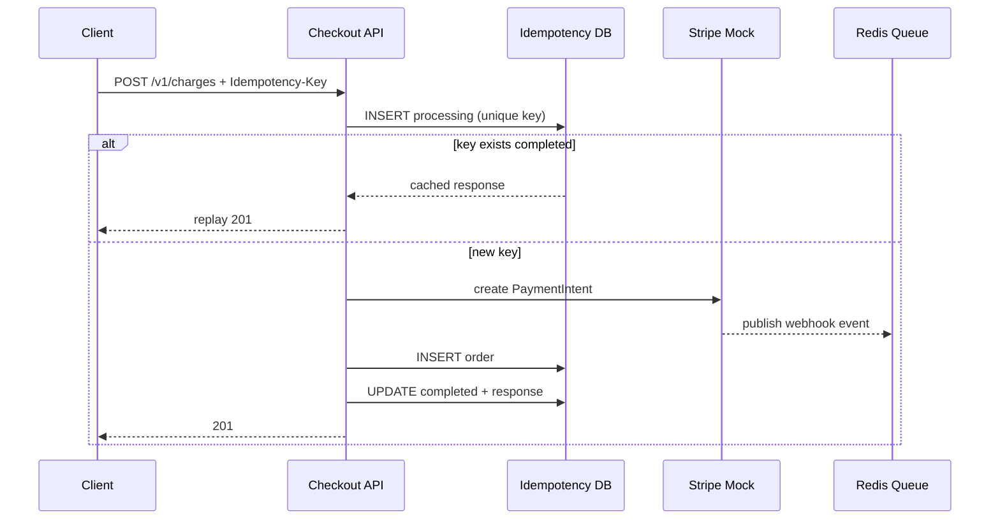

# Lab 017: Architecture

## Local ↔ AWS mapping

| Scenario (AWS) | Local lab |
|----------------|-----------|
| CloudFront + ALB | `localhost:8080` |
| ECS Fargate Checkout API | FastAPI `src/api.py` |
| Aurora PostgreSQL | PostgreSQL 16 (Docker) or SQLite |
| Stripe API | `src/stripe_mock.py` |
| SQS webhook queue | Redis list (`src/queue.py`) |
| Lambda webhook worker | `src/webhook_worker.py` |
| EventBridge + sweeper Lambda | `src/sweeper.py` |
| Secrets Manager | Environment variables |

## Request lifecycle



## Idempotency state machine

| State | Meaning | Next states |
|-------|---------|-------------|
| `processing` | Charge in flight | `completed`, (sweeper heal) |
| `completed` | Response cached | terminal (replay only) |
| `failed` | Terminal error | terminal |

## Data model

- `idempotency_keys (tenant_id, idempotency_key)` — unique, stores response replay
- `orders` — business ledger; one row per successful charge
- `webhook_events (event_id)` — dedup table for async path

## Fail-closed policy

If the idempotency store is unavailable, the API returns **503** and does **not** call Stripe — matching scenario checklist item *fail closed when dedup store unavailable*.

## Swagger UI

Open `http://localhost:8080/docs`. The charge endpoint uses a typed `ChargeRequest` schema:

```json
{"amount_cents": 2500, "currency": "usd"}
```

Invalid bodies return **422** (validation error). A missing `Idempotency-Key` returns **400**.

## Verifying new charge vs replay

| Signal | New charge | Idempotent replay |
|--------|------------|-------------------|
| `order_id` | New value | Same as first call |
| `payment_intent_id` | New value | Same as first call |
| `orders` row count | +1 | Unchanged |
| `idempotency_keys.status` | `completed` (first write) | `completed` (read cached JSON) |

