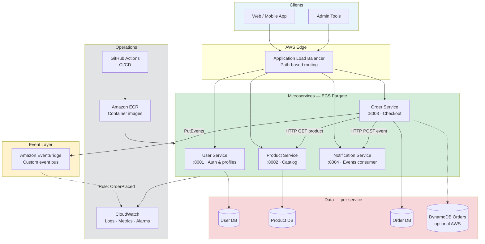

# Diagram 1 — Platform Overview

High-level view of what students build by the end of the course.

## Legend

| Symbol | Meaning |
|--------|---------|
| Solid arrow | Synchronous HTTP |
| Dashed arrow | Async / optional |
| Per-service DB | Database-per-service pattern |

## Student takeaway

Each box is **owned by one team**, deployed **independently**, and observable in **production**.
