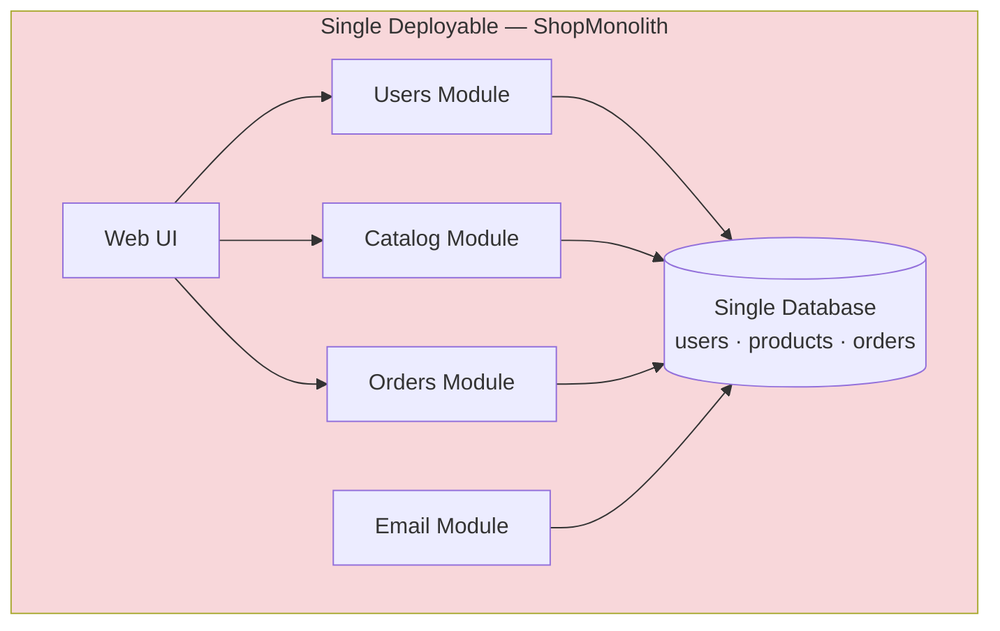
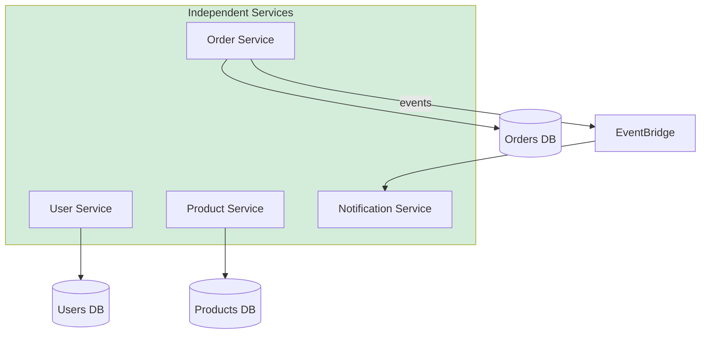

# Diagram 2 — Monolith vs Microservices

Use in **Module 1** when discussing trade-offs.

## Monolith (ShopMonolith)

**Problems:** One deployment affects everything · Shared DB coupling · Hard to scale one feature · Blast radius on failure

---

## Microservices (Course platform)

**Benefits:** Independent deploy · Clear ownership · Scale order path separately · Smaller failure domains

---

## Comparison table (for slides)

| Dimension | Monolith | Microservices |
|-----------|----------|---------------|
| Deployment | One unit | Many units |
| Data | Often shared | Database per service |
| Team structure | One codebase | Service teams |
| Complexity | Lower initially | Higher always |
| Best when | Small team, unclear domain | Clear boundaries, scale needs |
