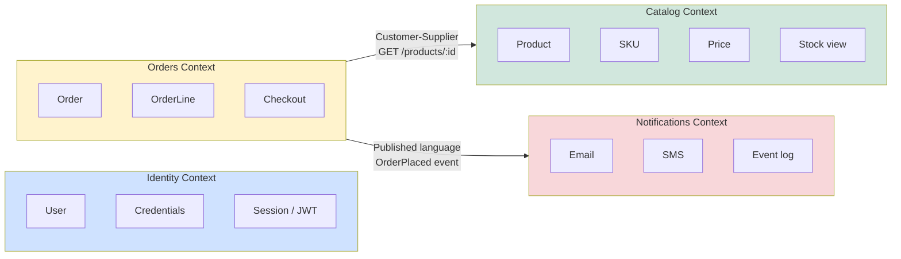
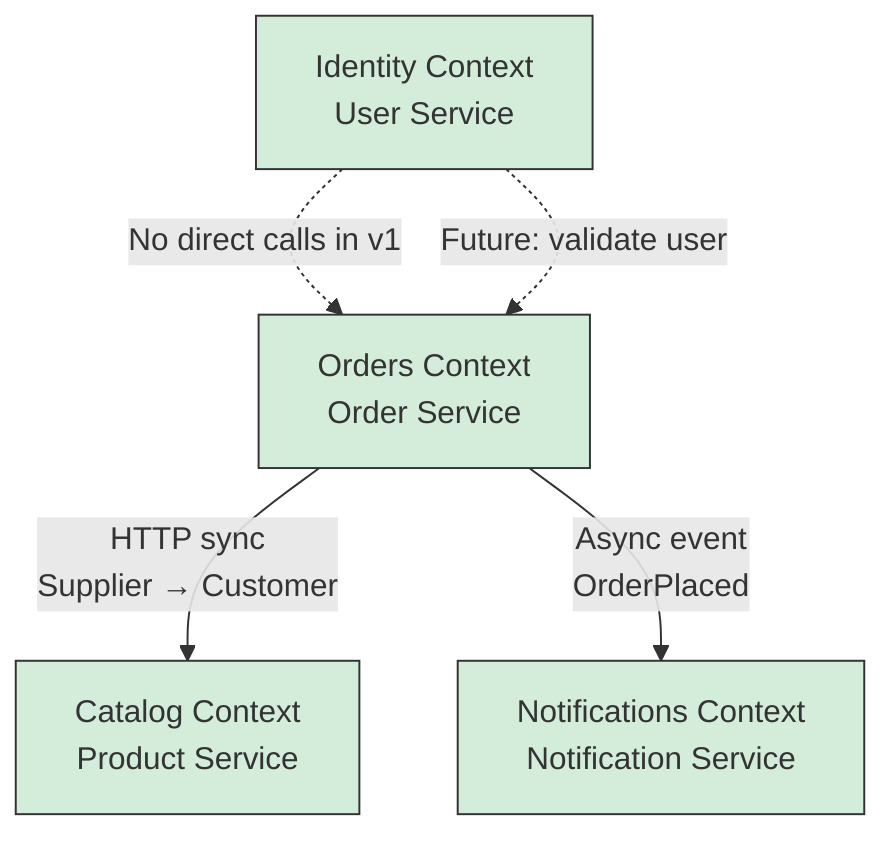
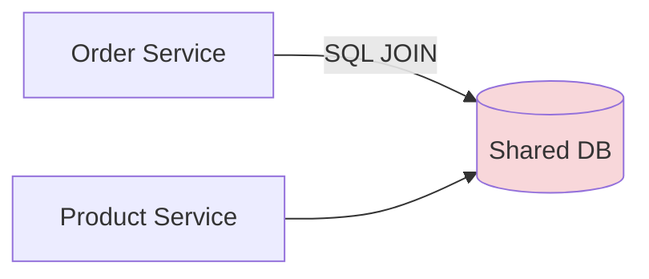

# Diagram 3 — Bounded Contexts & Context Map

**Module 1** — Domain-Driven Design foundation for the e-commerce capstone.

## Bounded contexts

## Context map (relationships)

## Ubiquitous language (examples)

| Context | Terms students must use consistently |
|---------|--------------------------------------|
| Identity | User, register, login, JWT |
| Catalog | Product, SKU, list price, stock |
| Orders | Order, line item, placed, total |
| Notifications | OrderPlaced, confirmation, subscriber |

## Anti-pattern to call out

**Never** let Order Service query Product tables directly — use **API** or **events**.
