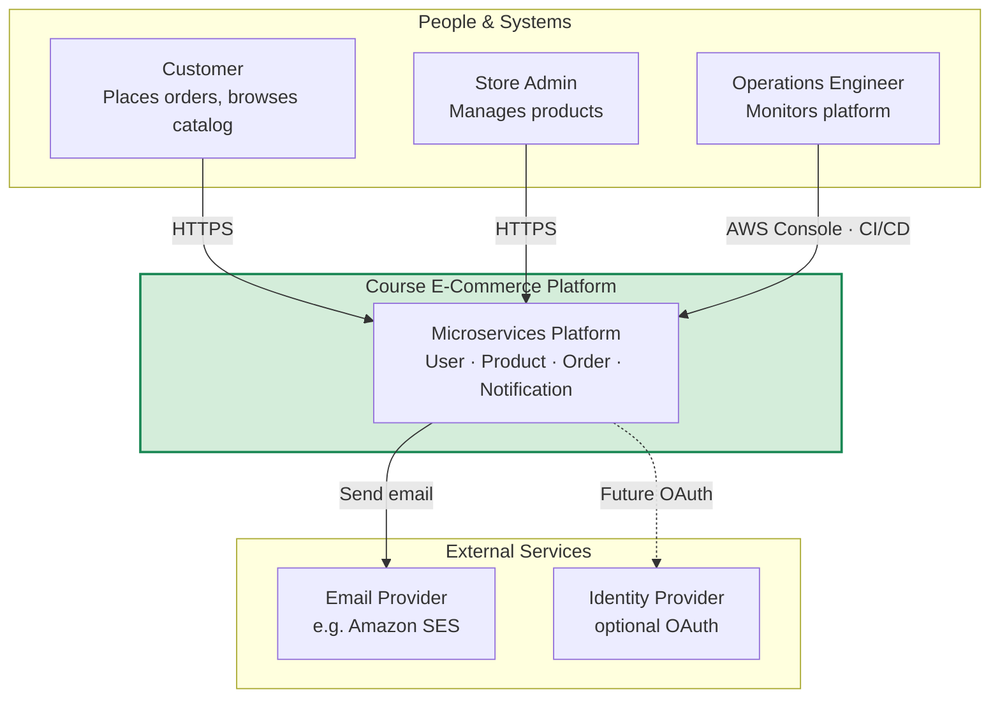

# Diagram 4 — C4 Model: System Context (Level 1)

Shows the platform boundary and external actors. Required for **capstone** architecture submissions.

## Description (for architecture document)

The **Course E-Commerce Platform** lets customers register, browse products, and place orders. Store admins manage the catalog. The platform publishes domain events when orders are placed and sends notifications asynchronously. Operations teams deploy and monitor services on AWS ECS.

## Capstone checklist

- [ ] Name all actors
- [ ] Show single system boundary
- [ ] Label protocols (HTTPS, events)
