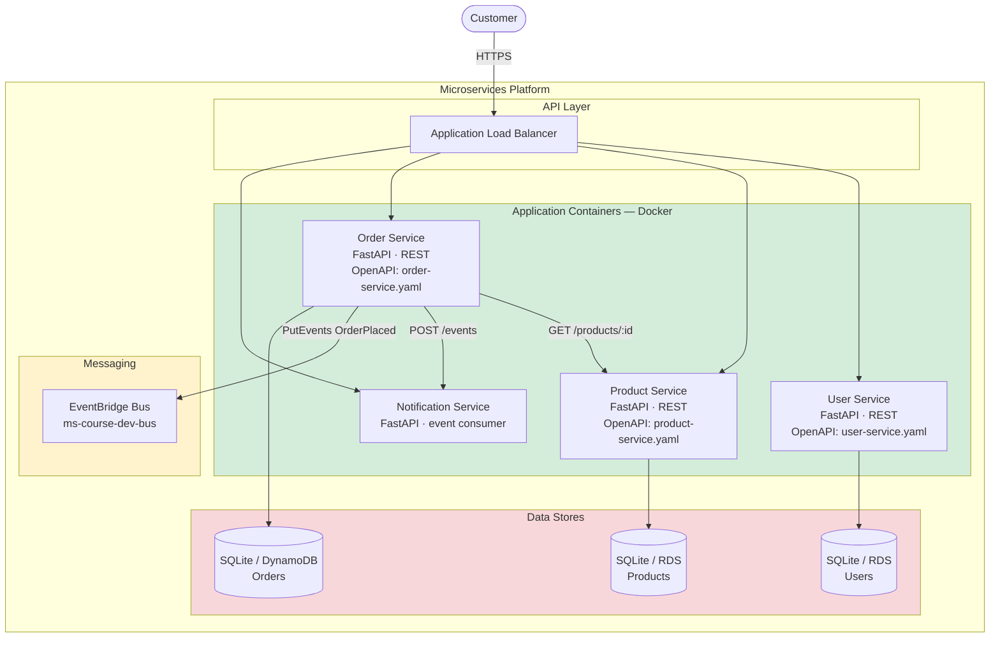

# Diagram 5 — C4 Model: Container Diagram (Level 2)

**Module 2+** — Containers = deployable units (services, databases, message bus).

## Technology mapping

| Container | Technology in course repo |
|-----------|---------------------------|
| User Service | `starters/python/user-service` |
| Product Service | `starters/python/product-service` |
| Order Service | `starters/python/order-service` |
| Notification Service | `starters/python/notification-service` |
| Event bus | `contracts/events/order-placed.json` |

## Ports (local)

| Service | Port |
|---------|------|
| User | 8001 |
| Product | 8002 |
| Order | 8003 |
| Notification | 8004 |
