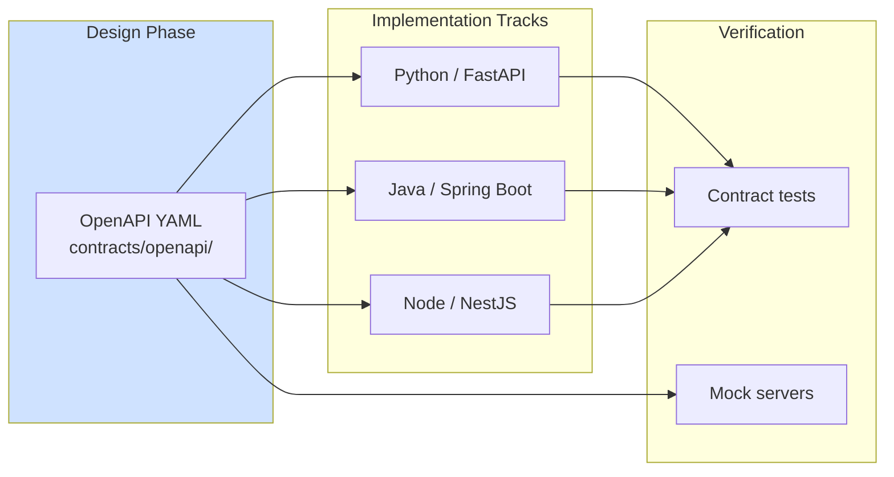
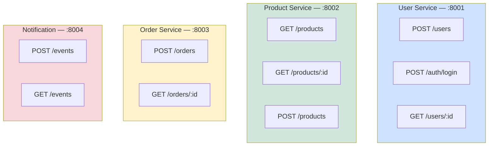
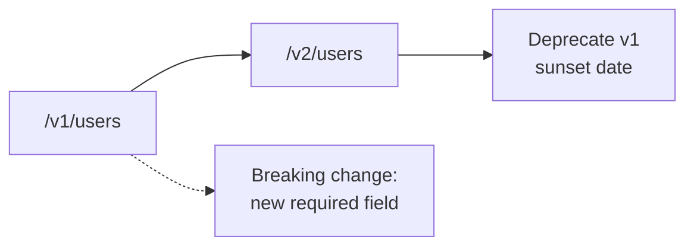

# Diagram 6 — API Contracts & OpenAPI-First Development

**Module 2** — Contract-driven development between teams.

## API surface (course platform)

## Versioning strategy (teaching slide)

| Status code | When |
|-------------|------|
| 201 | Created |
| 400 | Validation error |
| 401 | Invalid JWT |
| 404 | Not found |
| 409 | Duplicate email / SKU |
