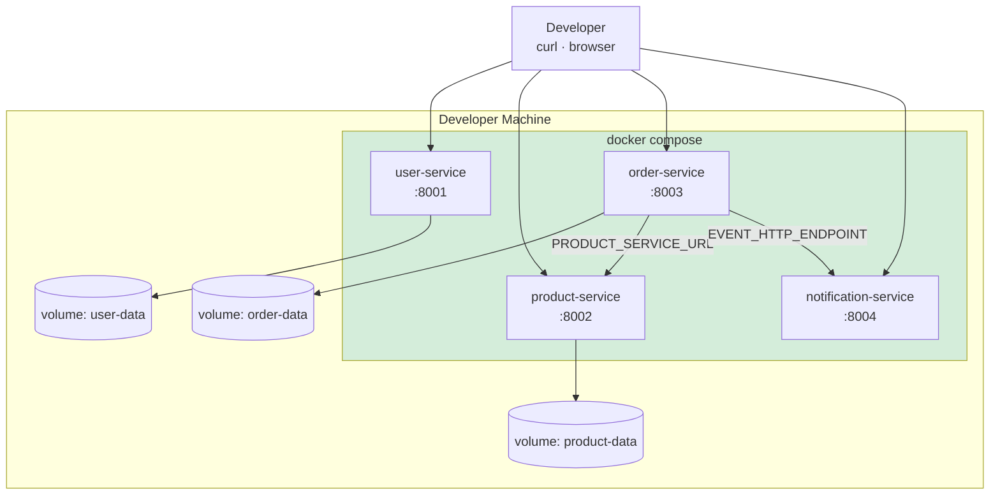
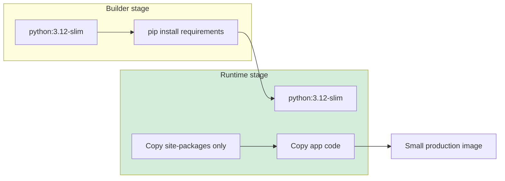

# Diagram 7 — Local Development (Docker Compose)

**Module 3** — How services run on a student laptop.



## Multi-stage Docker build



## Commands

```bash
docker compose up --build
./scripts/demo-platform.sh
```
