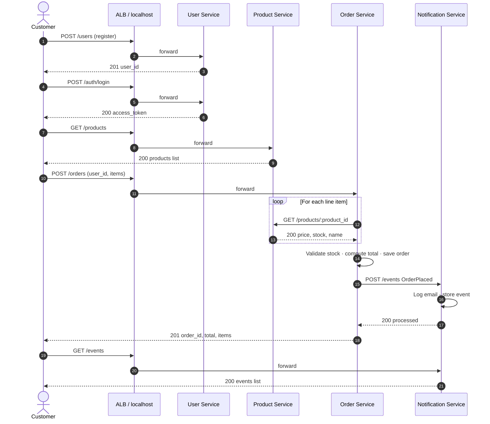
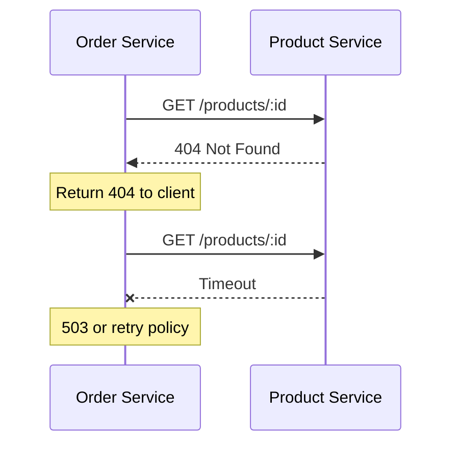

# Diagram 8 — Sequence: Place Order (Synchronous Path)

**Modules 2 & 5** — Step-by-step request flow students debug in labs.

## Failure scenarios (discussion)

## Student debug checklist

1. All four health endpoints (local) or `/products` (AWS ALB)
2. Product exists before ordering
3. Check `GET /events` on notification service
