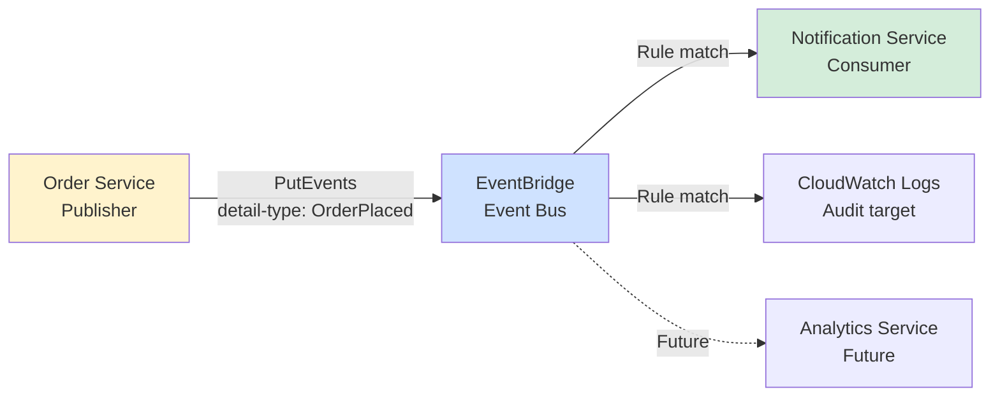
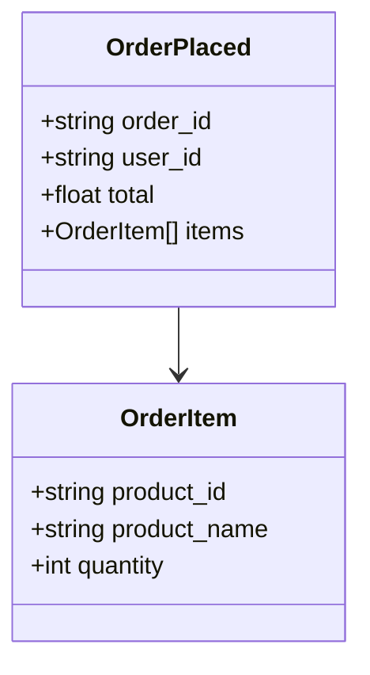
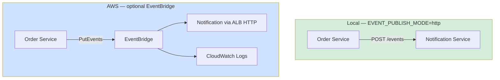
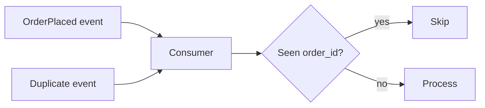

# Diagram 9 — Event-Driven Architecture

**Module 5** — Async decoupling with `OrderPlaced`.

## Choreography (course default)

## Event schema

**Contract file:** `contracts/events/order-placed.json`

## Local vs AWS publishing

## Sync vs async (why events?)

| Approach | Coupling | If notification is down |
|----------|----------|-------------------------|
| Sync HTTP call from Order | Tight | Order fails |
| Async event | Loose | Order succeeds; retry/DLQ |

## Idempotency note

