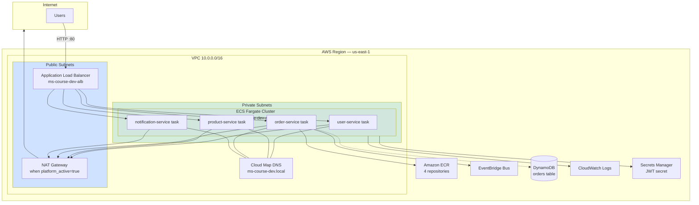
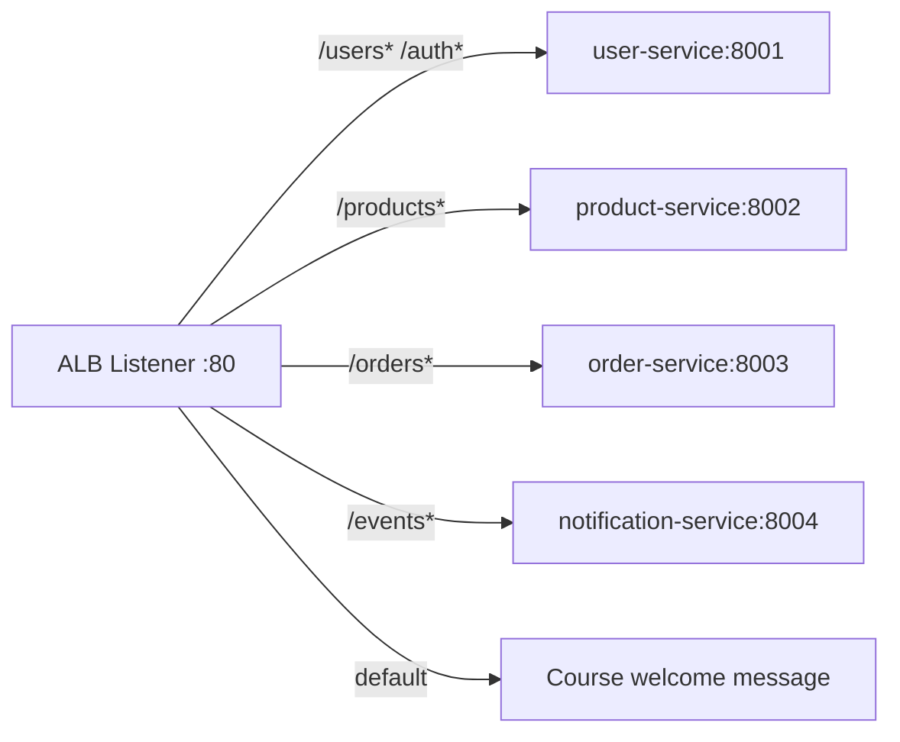
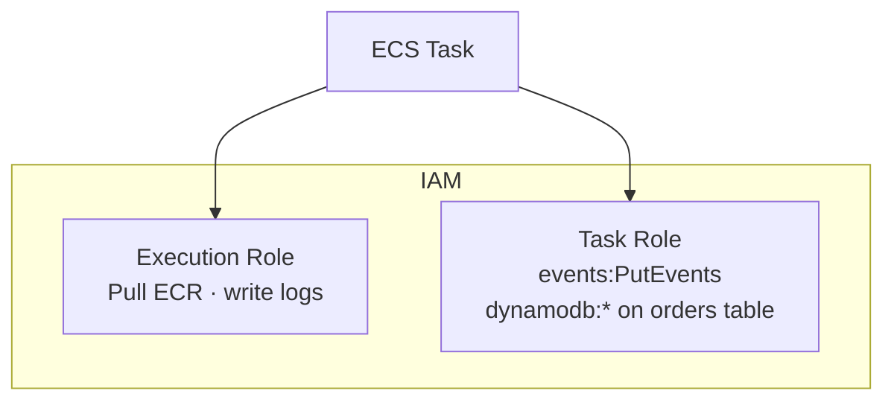
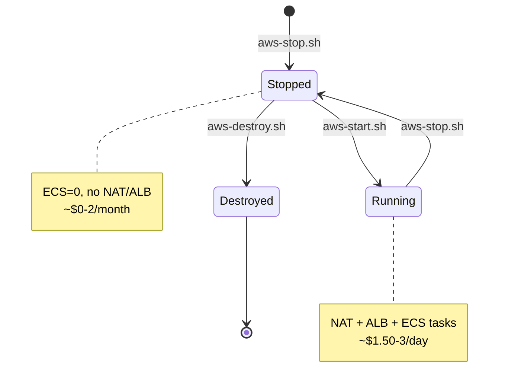

# Diagram 10 — AWS Deployment Architecture

**Module 4** — VPC, ECS Fargate, ALB (matches `infrastructure/terraform/`).

> **AWS Architecture Icons (detailed):** [aws-stencils/png/10-vpc-ecs-deployment-detail.png](aws-stencils/png/10-vpc-ecs-deployment-detail.png) · [draw.io source](aws-stencils/drawio/10-vpc-ecs-deployment-detail.drawio) · [ALB routing stencil](aws-stencils/png/10-alb-path-routing-detail.png)

## Regional deployment

## ALB path routing

## ECS task IAM roles

## Terraform lifecycle

