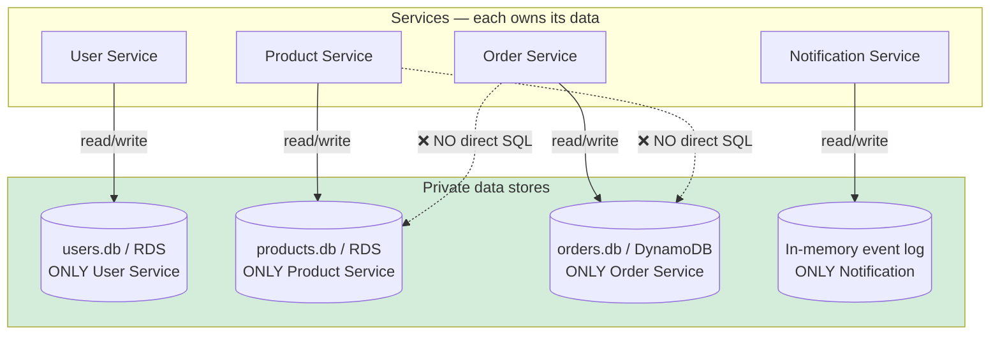
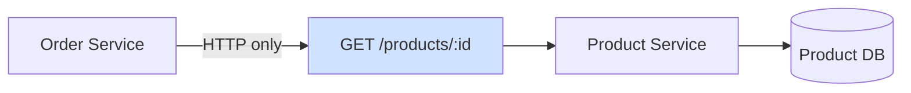

# Diagram 11 — Data Ownership (Database per Service)

**Module 6** — No shared database anti-pattern.

## How Order gets product data

## DynamoDB orders table (AWS extension)

| Attribute | Type | Notes |
|-----------|------|-------|
| order_id | String (PK) | Partition key |
| user_id | String | GSI candidate |
| total | Number | |
| items | List/Map | Embedded or separate table |

**Table name:** `ms-course-dev-orders`
