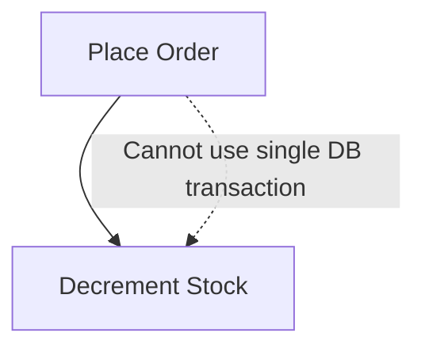
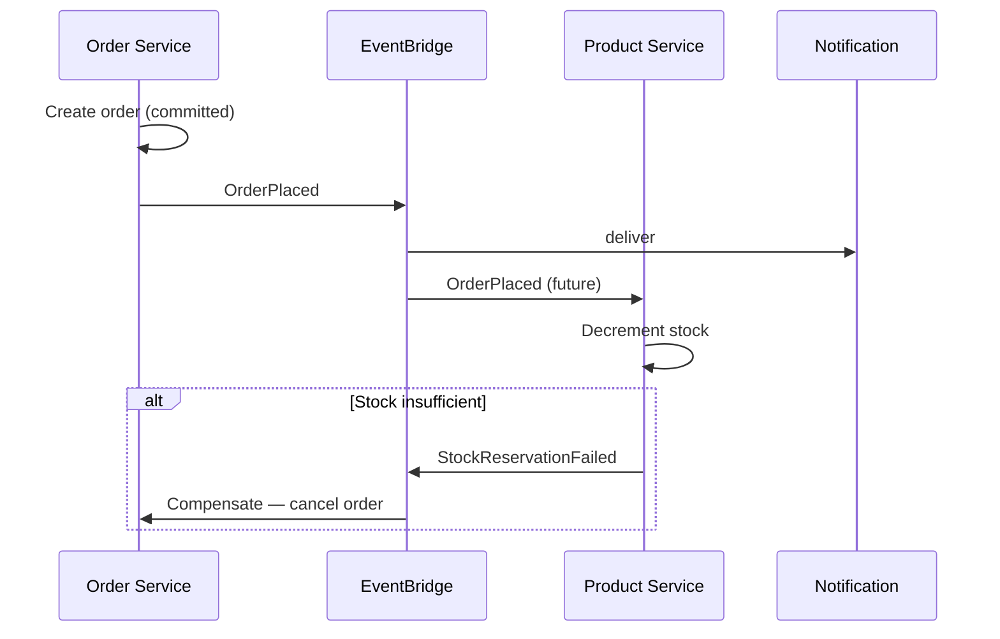
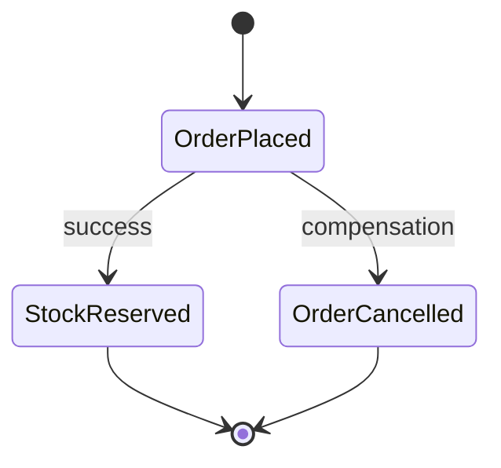
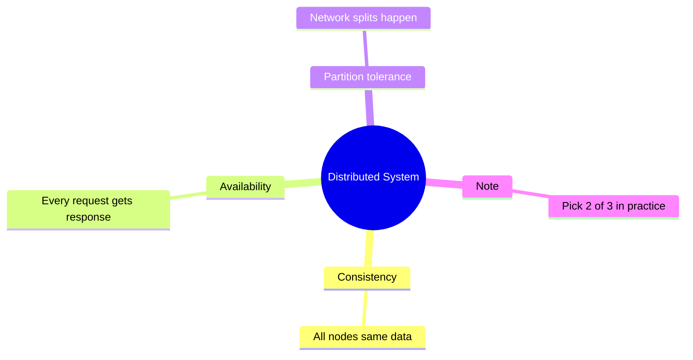

# Diagram 12 — Saga Pattern & Eventual Consistency

**Module 6** — Stock decrement after order (extension lab).

## Problem: cross-service transaction

## Choreography saga (recommended teaching example)

## Saga states

## Strong vs eventual

| Pattern | Consistency | Complexity |
|---------|-------------|------------|
| Single monolith DB | Strong | Low |
| 2PC across DBs | Strong | Very high |
| Saga + events | Eventual | Medium |
| Read-your-writes via API | Per-service | Low |

## CAP theorem (one slide)

