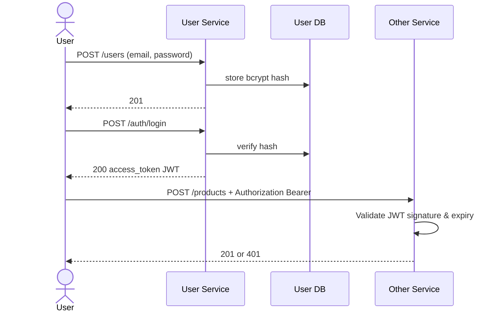
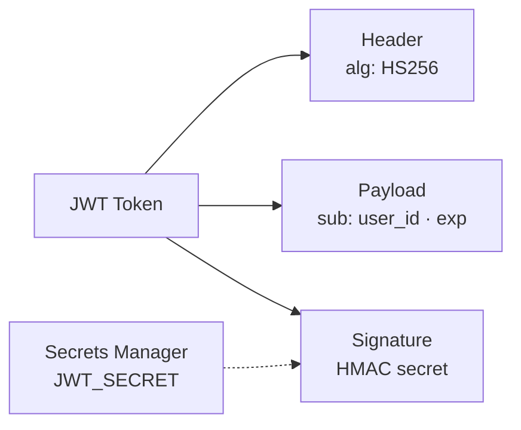
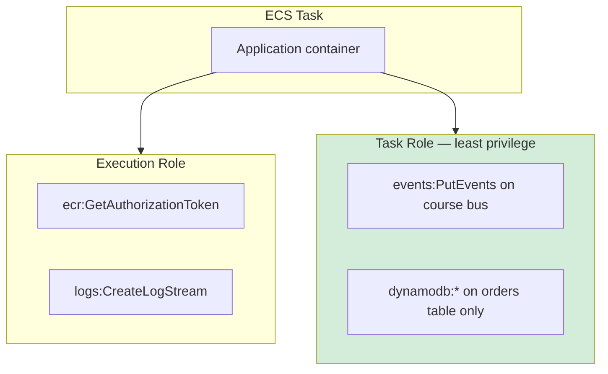
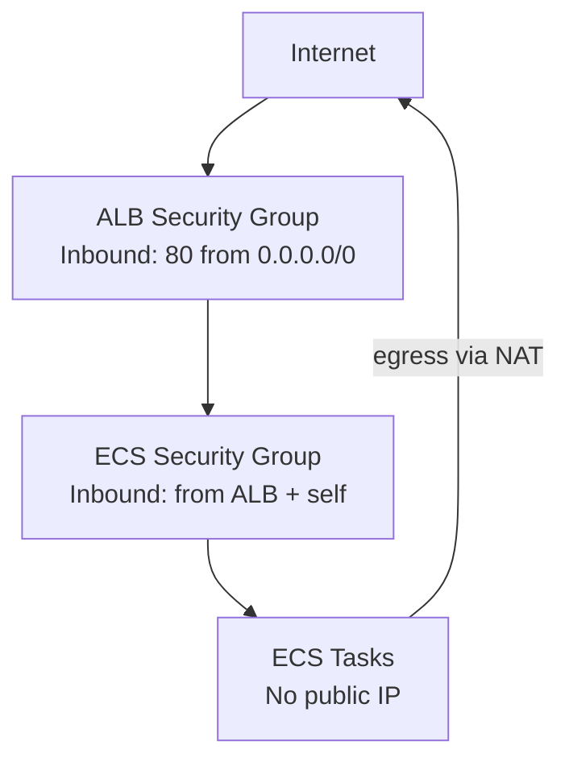

# Diagram 13 — Security Architecture

**Module 7** — JWT, IAM, secrets, network.

## Authentication flow (JWT)

## JWT structure (teaching)

## ECS IAM — two roles

## Network security

## Security checklist mapping

| Control | Implementation |
|---------|----------------|
| Secrets not in Git | Secrets Manager + `.env.example` |
| Password hashing | bcrypt in user-service |
| Least privilege IAM | Scoped task role |
| TLS in production | HTTPS on ALB (extension) |
