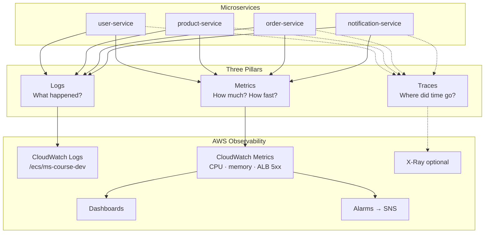
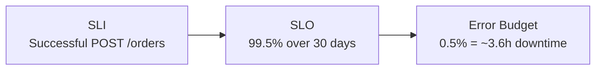
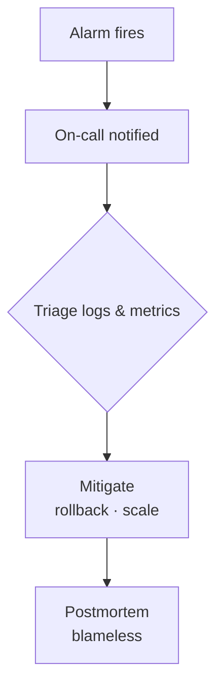

# Diagram 14 — Observability (Three Pillars)

**Module 8** — CloudWatch, logs, metrics, SLOs.

## SLO example (order service)

## Incident response flow

## Key log queries (teaching)

| Goal | Where |
|------|-------|
| Failed orders | `/ecs/ms-course-dev` filter `order-service` |
| OrderPlaced events | `/eventbridge/ms-course-dev/orders` |
| ALB errors | ALB 5xx metric |
