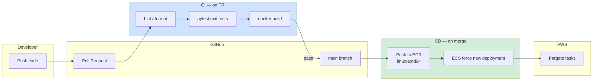
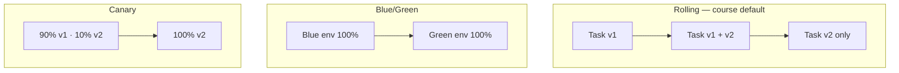
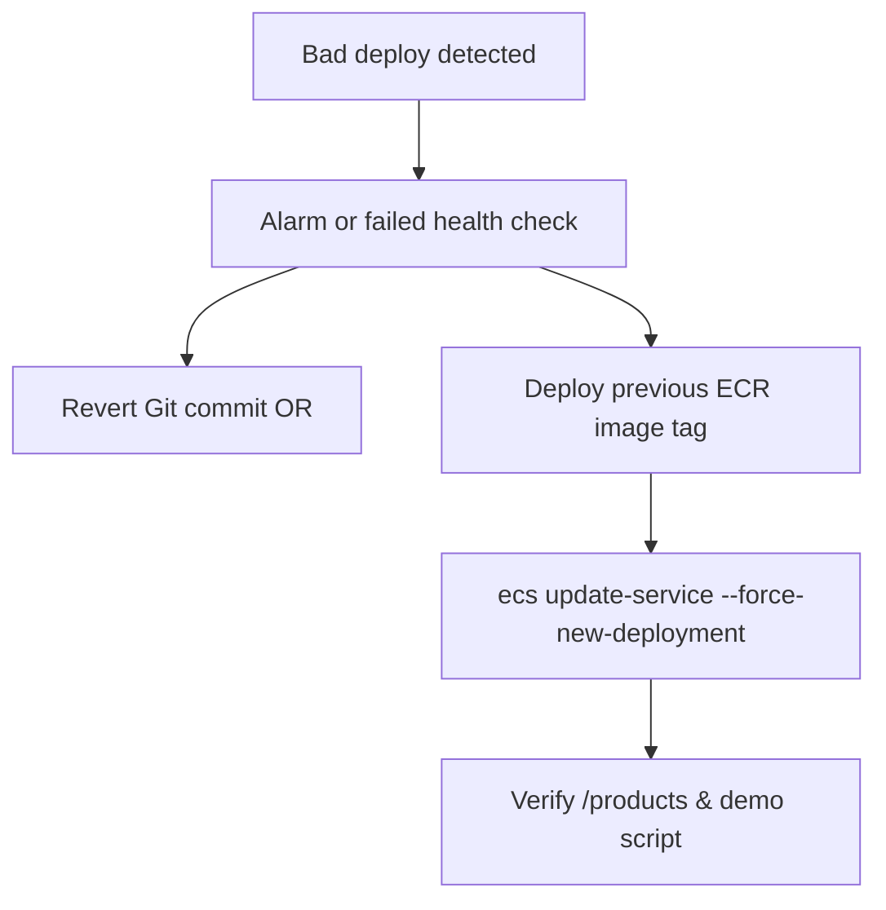

# Diagram 15 — CI/CD Pipeline

**Module 9** — GitHub Actions to ECS.

## Deployment strategies

| Strategy | Downtime | Rollback |
|----------|----------|----------|
| Rolling | Minimal | Previous task definition |
| Blue/Green | Near zero | Switch traffic |
| Canary | Near zero | Reduce canary % |

## Rollback runbook

**Workflow files:** `.github/workflows/ci-service.yml`, `deploy-ecs.yml`
