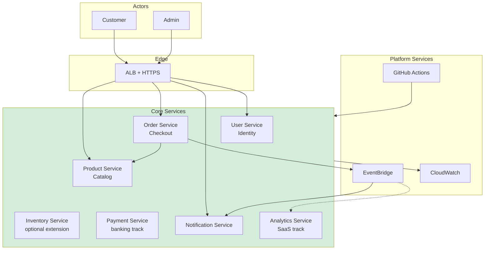
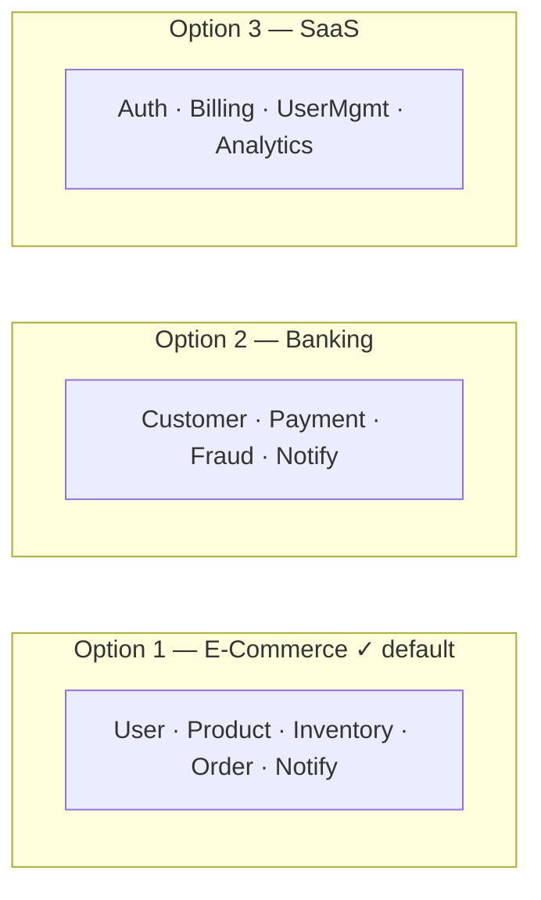
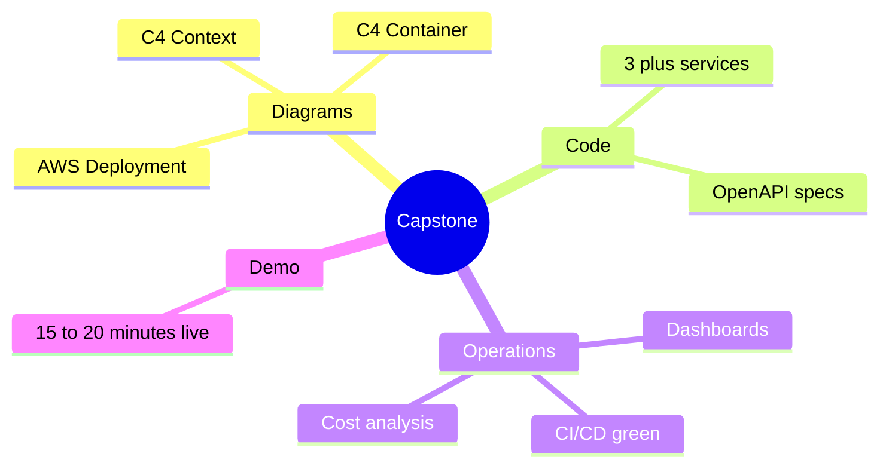
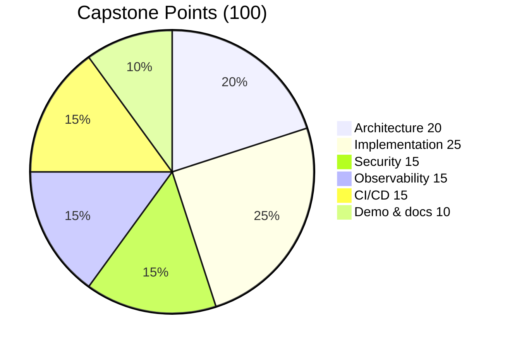

# Diagram 16 — Capstone: E-Commerce Platform

**Module 10** — Full reference architecture for student submissions.

## End-state architecture

## Capstone track options

## Deliverables map

## Grading rubric (visual)

See `capstone/rubrics.md` for full criteria.
