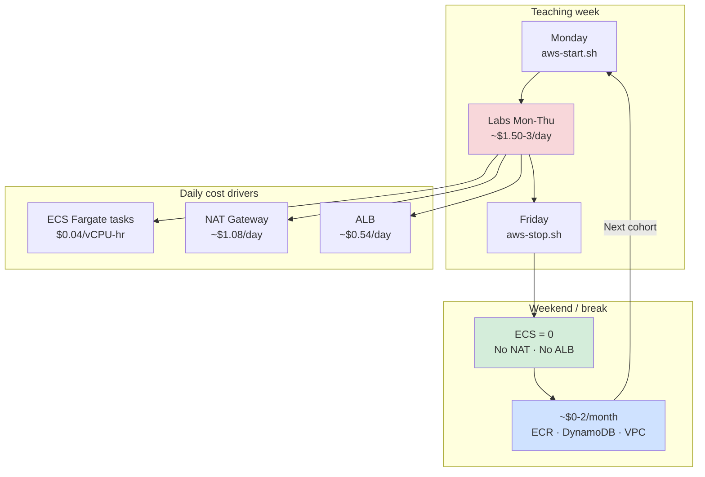
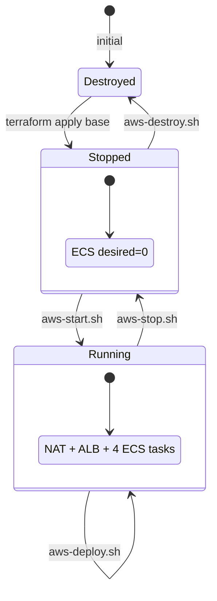
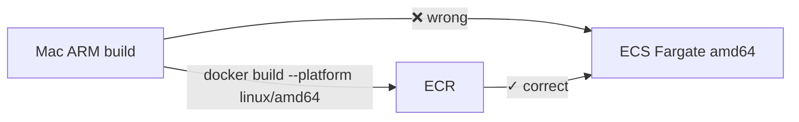

# Diagram 17 — AWS Cost Lifecycle (Instructor)

When to start/stop infrastructure for cohorts.

```mermaid
flowchart TB
    subgraph Week["Teaching week"]
        MON[Monday<br/>aws-start.sh]
        LAB[Labs Mon-Thu<br/>~$1.50-3/day]
        FRI[Friday<br/>aws-stop.sh]
    end

    subgraph Costs["Daily cost drivers"]
        FARGATE[ECS Fargate tasks<br/>$0.04/vCPU-hr]
        NAT[NAT Gateway<br/>~$1.08/day]
        ALB[ALB<br/>~$0.54/day]
    end

    subgraph Idle["Weekend / break"]
        STOP[ECS = 0<br/>No NAT · No ALB]
        LOW[~$0-2/month<br/>ECR · DynamoDB · VPC]
    end

  MON --> LAB
    LAB --> FARGATE & NAT & ALB
    LAB --> FRI
    FRI --> STOP
    STOP --> LOW
    LOW -->|Next cohort| MON

    style LAB fill:#f8d7da
    style STOP fill:#d4edda
    style LOW fill:#cfe2ff
```

## State machine (scripts)

```mermaid
stateDiagram-v2
    [*] --> Destroyed: initial
    Destroyed --> Stopped: terraform apply base
    Stopped --> Running: aws-start.sh
    Running --> Stopped: aws-stop.sh
    Stopped --> Destroyed: aws-destroy.sh
    Running --> Running: aws-deploy.sh

    state Running {
        [*] --> Active
        Active: NAT + ALB + 4 ECS tasks
    }

    state Stopped {
        [*] --> Idle
        Idle: ECS desired=0
    }
```

## Build platform note

```mermaid
flowchart LR
    MAC[Mac ARM build] -->|❌ wrong| ECS[ECS Fargate amd64]
    MAC -->|docker build --platform linux/amd64| ECR[ECR]
    ECR -->|✓ correct| ECS
```

**Doc:** `docs/AWS_COST_CONTROL.md`
