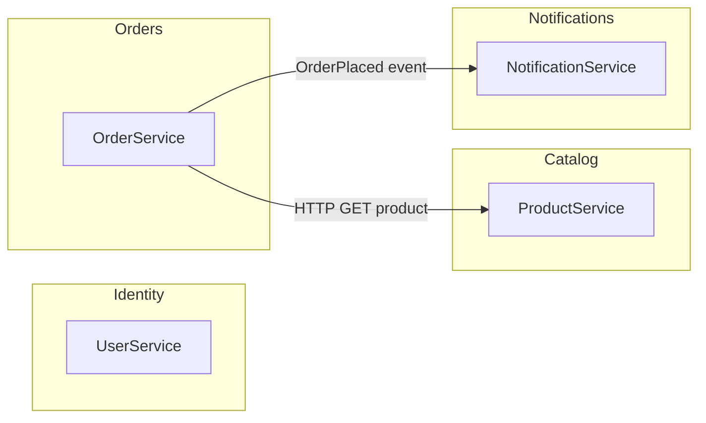

# Context Map — Student Template

Use the **reference diagram** in the course repo:  
[docs/diagrams/03-bounded-contexts-context-map.md](../../docs/diagrams/03-bounded-contexts-context-map.md)

**Your task:** Customize for your capstone domain (e-commerce, banking, or SaaS). Export PNG via [mermaid.live](https://mermaid.live) and submit with your decomposition doc.
