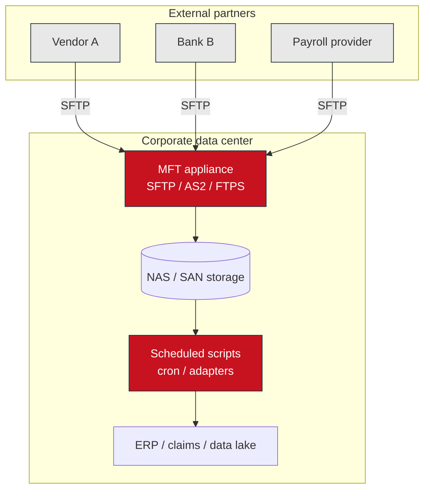
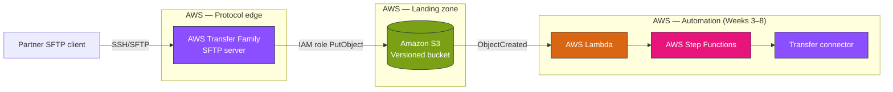
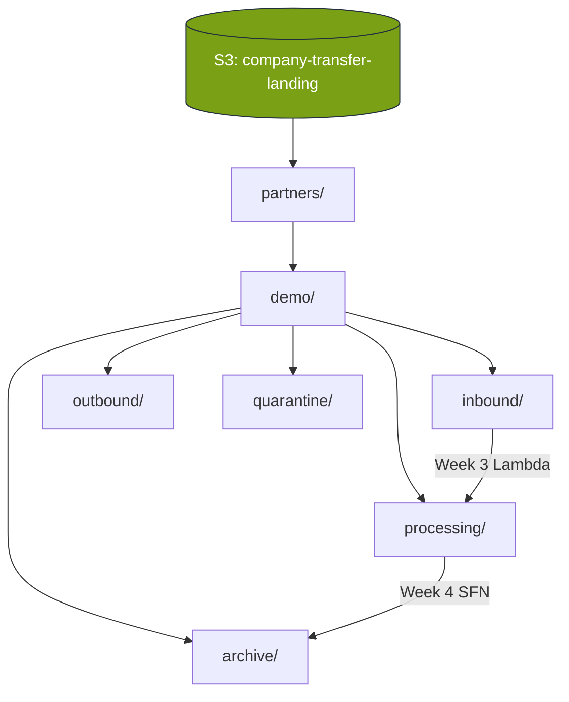
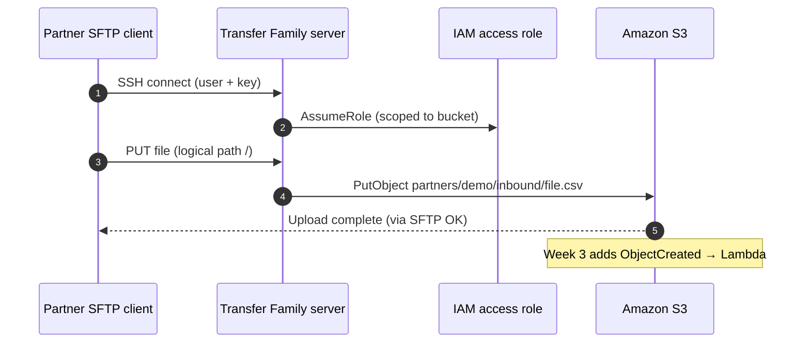
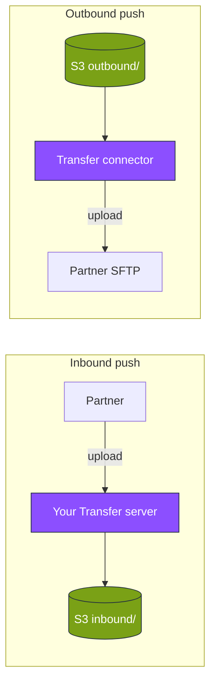

# Module 1 — AWS stencil diagrams: Enterprise MFT & Transfer Family

**Module:** [week-01.md](../modules/week-01.md) · **Lab:** [Lab 1](../labs/lab-01-transfer-family-sftp.md)

---

## Diagram 1 — Legacy MFT appliance (before AWS)

What many enterprises run today: a single appliance in the data center.

**Student takeaway:** The appliance is the **bottleneck** for scale, DR, and API integration.

---

## Diagram 2 — AWS Transfer Family + S3 (course target)

Managed protocol edge; S3 is the **system of record**.

---

## Diagram 3 — Hub-and-spoke S3 prefix model

Prefixes are **security and lifecycle boundaries**, not folders.

**Lab 1 path:** `partners/demo/inbound/` ← SFTP home directory mapping.

---

## Diagram 4 — Lab 1: Partner upload sequence

Trace this path when troubleshooting “file not in S3.”

---

## Diagram 5 — Push vs pull (business direction)

| Arrow label | Meaning |
|-------------|---------|
| Partner → you | **Inbound push** (Lab 1 server) |
| You → partner | **Outbound push** (Module 5 connector) |
| You ← partner | **Pull** (connector retrieve) |

---

**Editable stencil:** [week-01-transfer-edge.drawio](week-01-transfer-edge.drawio)
