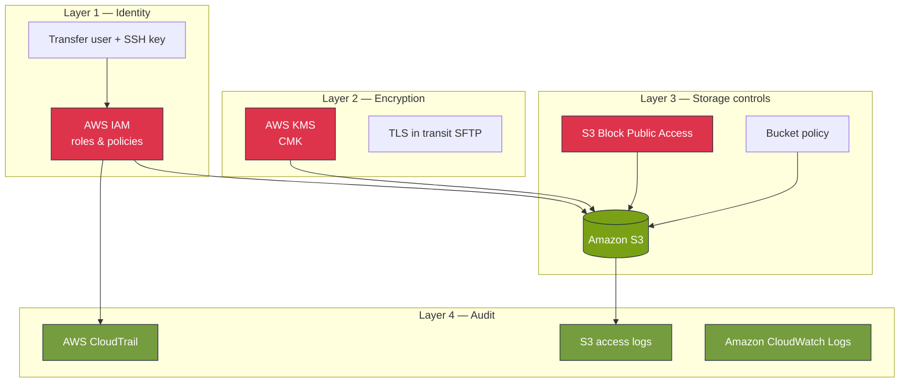
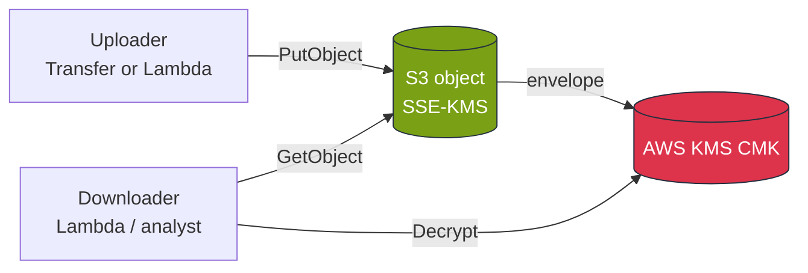
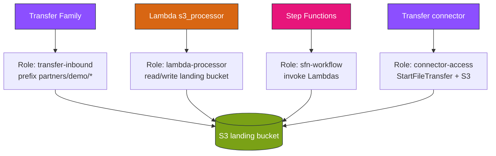
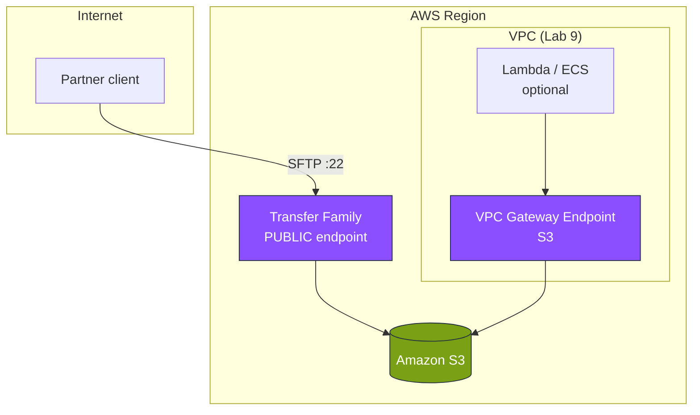
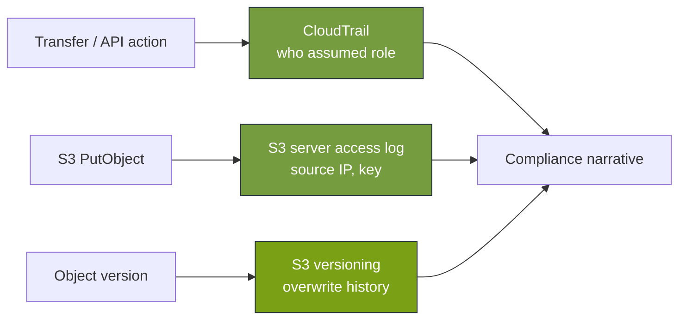

# Module 2 — AWS stencil diagrams: Security & governance

**Module:** [week-02.md](../modules/week-02.md) · **Lab:** [Lab 2](../labs/lab-02-security-hardening.md)

---

## Diagram 1 — Defense-in-depth layers

Each layer provides **evidence** for auditors.

---

## Diagram 2 — KMS encryption flow (SSE-KMS)

Who must have `kms:Decrypt`?

**Common failure:** Switch bucket to CMK but Lambda role lacks KMS permissions.

---

## Diagram 3 — IAM role separation (least privilege)

Never use one “super role” for all partners.

---

## Diagram 4 — Network: public Transfer + S3 gateway endpoint

Lab stack uses public Transfer endpoint; Lambda/ECS can use VPC endpoints.

---

## Diagram 5 — Audit evidence chain

Answer: “Who uploaded file X and when?”

---

**Editable stencil:** [week-02-security-governance.drawio](week-02-security-governance.drawio)
