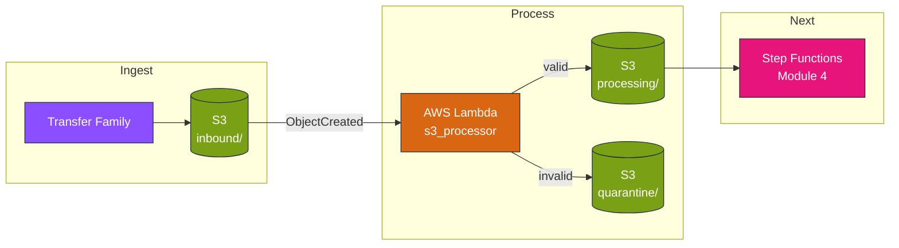
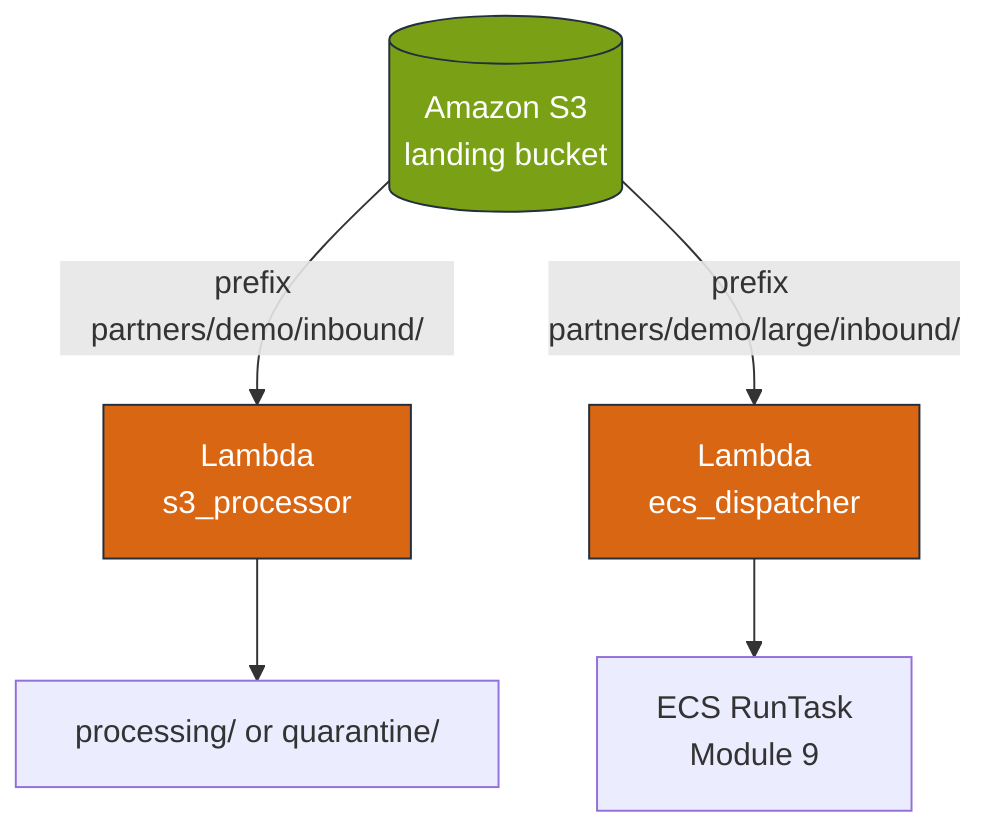
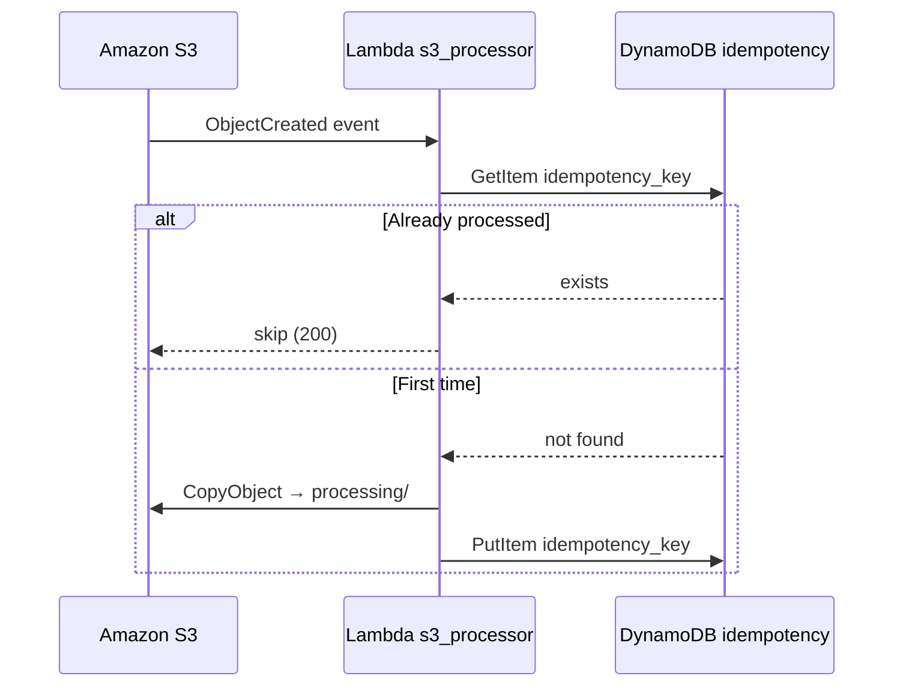
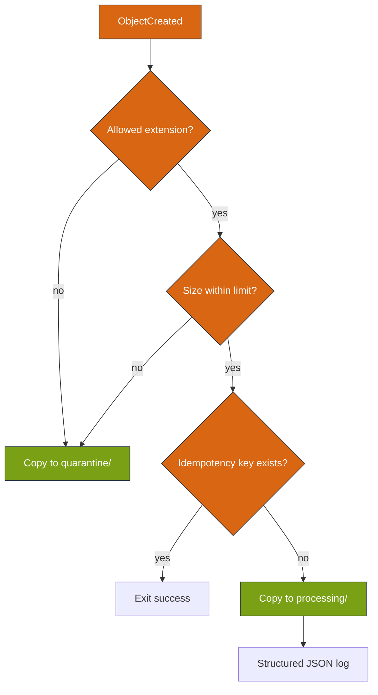
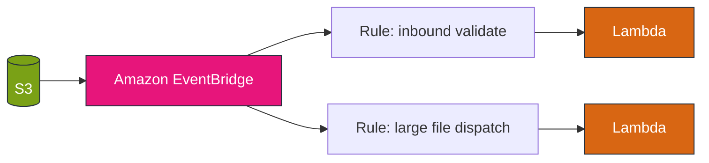

# Module 3 — AWS stencil diagrams: Event-driven automation

**Module:** [week-03.md](../modules/week-03.md) · **Lab:** [Lab 3](../labs/lab-03-s3-event-processor.md)

---

## Diagram 1 — End-to-end processing pipeline

---

## Diagram 2 — S3 event notification wiring

**Important:** One bucket = one notification configuration (all Lambda targets merged).

---

## Diagram 3 — Idempotency with DynamoDB

S3 events are **at-least-once**.

---

## Diagram 4 — Validation decision tree (Lambda logic)

---

## Diagram 5 — EventBridge alternative (production pattern)

Lab 3 uses direct S3→Lambda for simplicity.

---

**Editable stencil:** [week-03-event-driven.drawio](week-03-event-driven.drawio)
