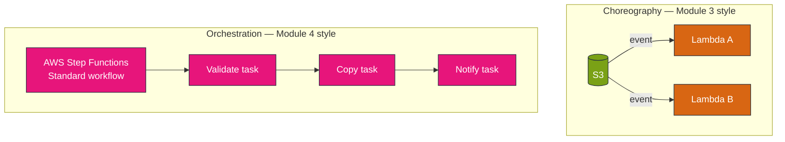
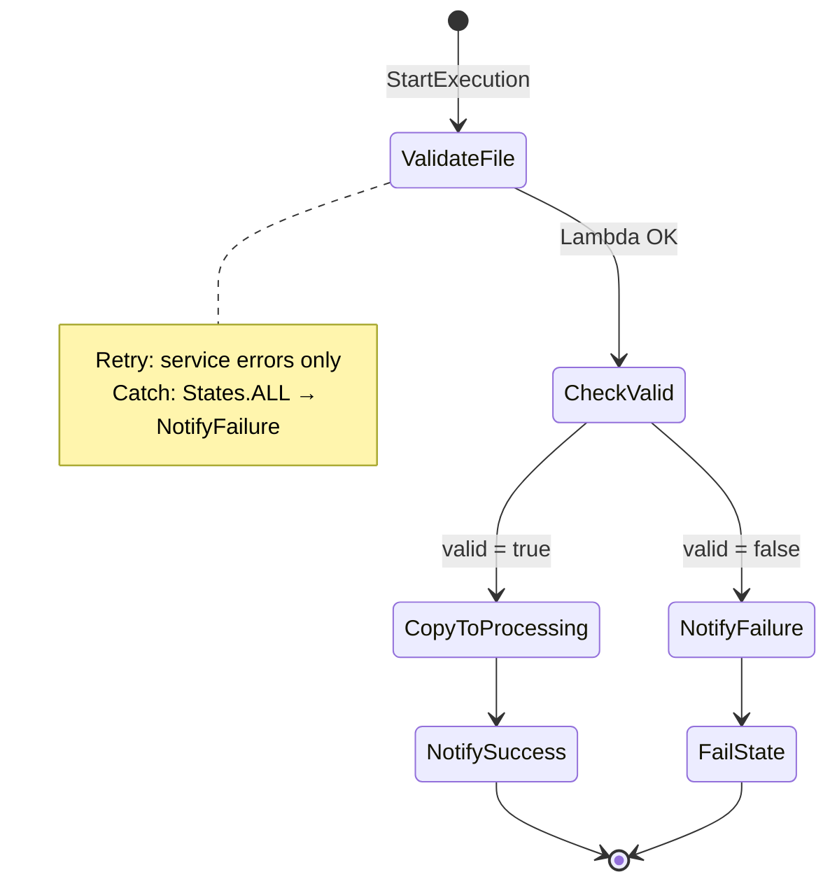
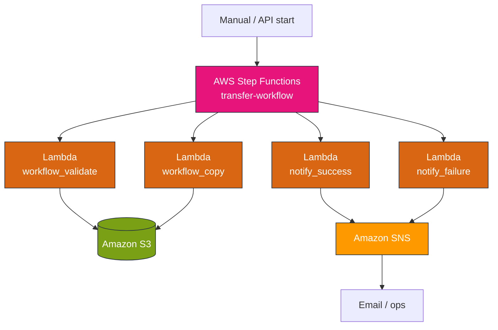
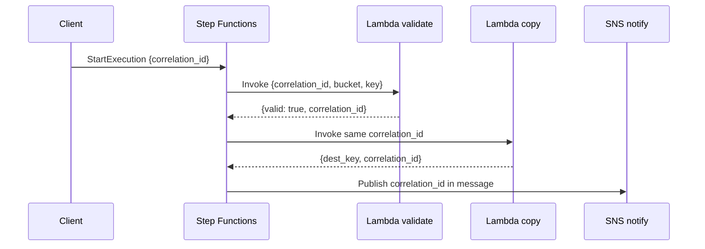
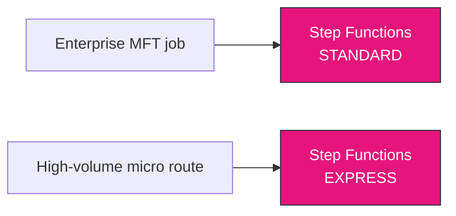

# Module 4 — AWS stencil diagrams: Step Functions orchestration

**Module:** [week-04.md](../modules/week-04.md) · **Lab:** [Lab 4](../labs/lab-04-step-functions-workflow.md)

---

## Diagram 1 — Orchestration vs choreography

---

## Diagram 2 — Lab 4 state machine (happy + failure paths)

---

## Diagram 3 — Step Functions + Lambda + SNS (lab stack)

---

## Diagram 4 — Correlation ID propagation

---

## Diagram 5 — Standard vs Express workflow choice

| Use **Standard** when | Use **Express** when |
|----------------------|----------------------|
| Auditors need full history | Sub-minute high volume |
| Runs minutes to hours | Fan-out micro-steps |
| Human approval waits | No long-running branch |

---

**Editable stencil:** [week-04-step-functions.drawio](week-04-step-functions.drawio)
