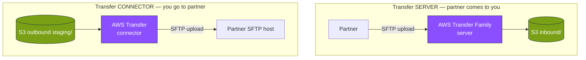
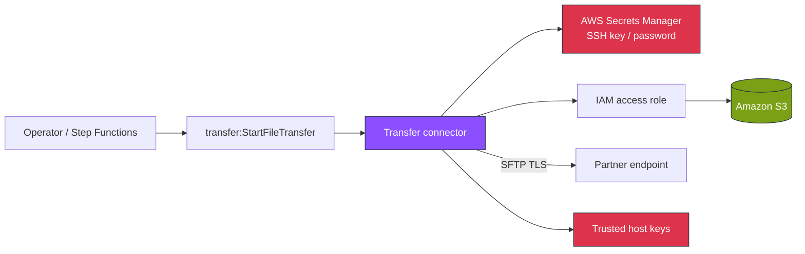
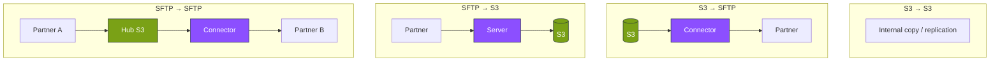
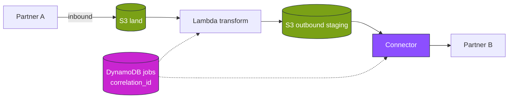
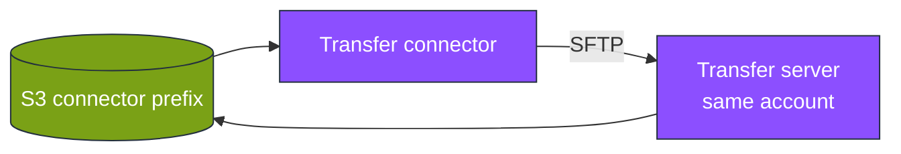

# Module 5 — AWS stencil diagrams: Connectors & partner routing

**Module:** [week-05.md](../modules/week-05.md) · **Lab:** [Lab 5](../labs/lab-05-sftp-connector.md)

---

## Diagram 1 — Transfer server vs connector

---

## Diagram 2 — Connector components

---

## Diagram 3 — Four canonical transfer patterns

---

## Diagram 4 — Multi-hop with correlation ID

---

## Diagram 5 — Lab 5: Connector to same server (loopback demo)

The lab connector points at **your own** Transfer server to avoid external partner dependencies.

---

**Editable stencil:** [week-05-connectors.drawio](week-05-connectors.drawio)
