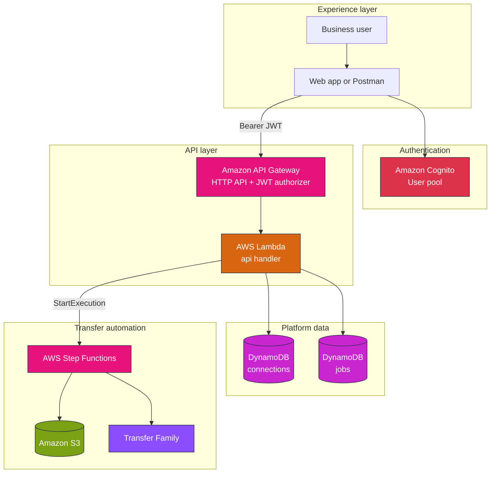
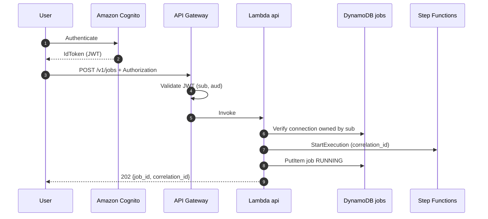
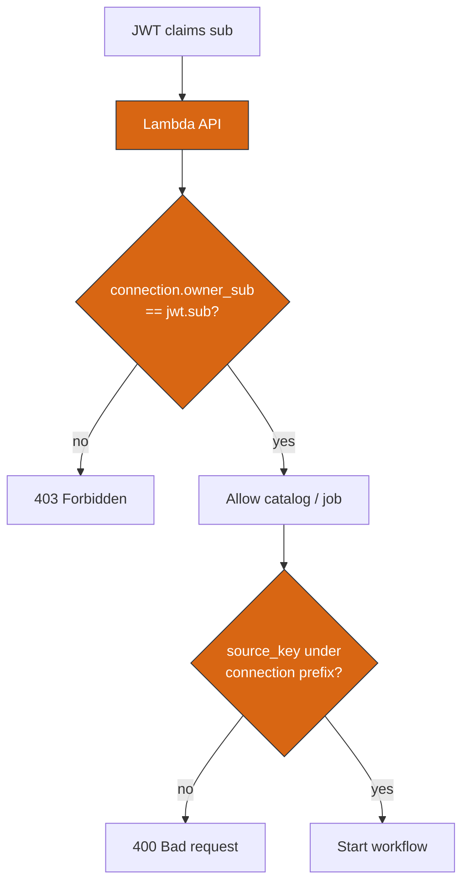
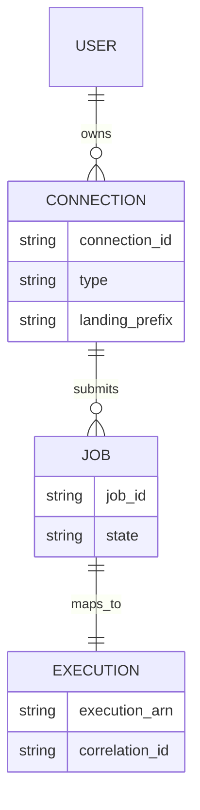
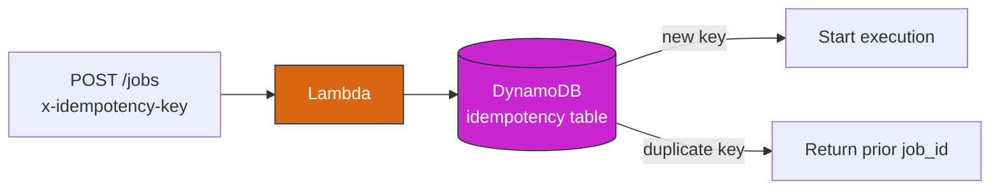

# Module 6 — AWS stencil diagrams: Self-serve platform

**Module:** [week-06.md](../modules/week-06.md) · **Lab:** [Lab 6](../labs/lab-06-self-serve-api.md)

---

## Diagram 1 — Self-serve control plane (logical)

---

## Diagram 2 — POST /v1/jobs sequence

---

## Diagram 3 — Authorization boundary (owner scope)

**Never return** Secrets Manager ARNs or SSH private keys in API responses.

---

## Diagram 4 — Entity relationship (simplified)

---

## Diagram 5 — Idempotency at API layer

---

**Editable stencil:** [week-06-self-serve-api.drawio](week-06-self-serve-api.drawio)
